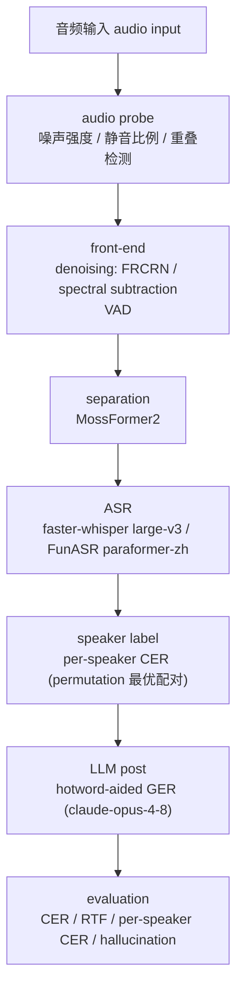
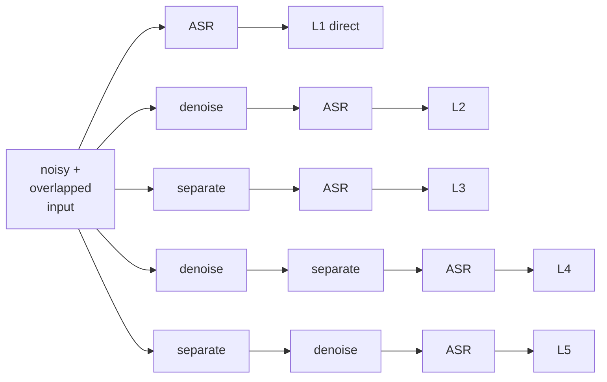
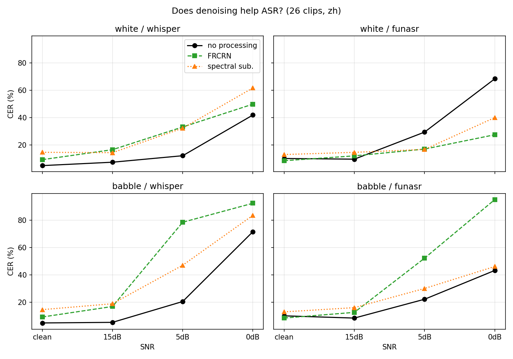
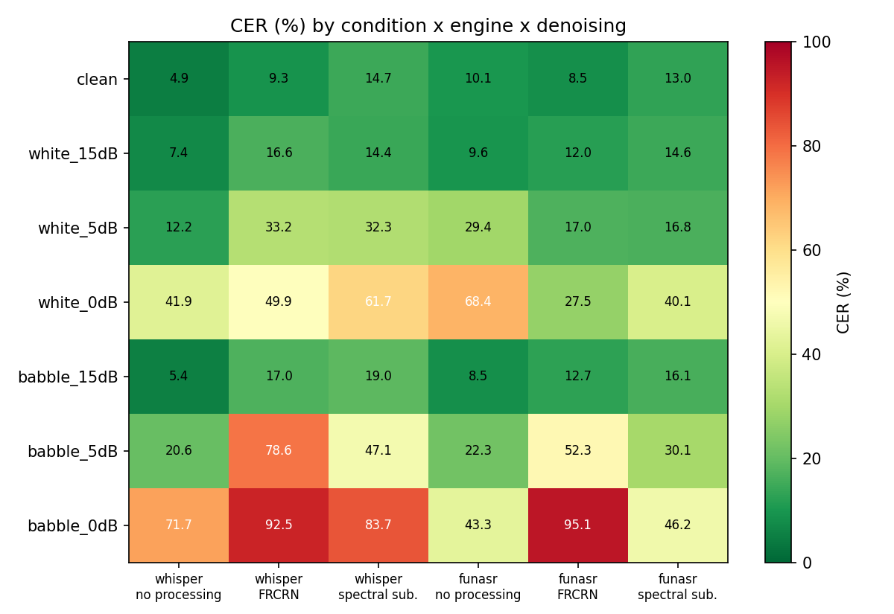
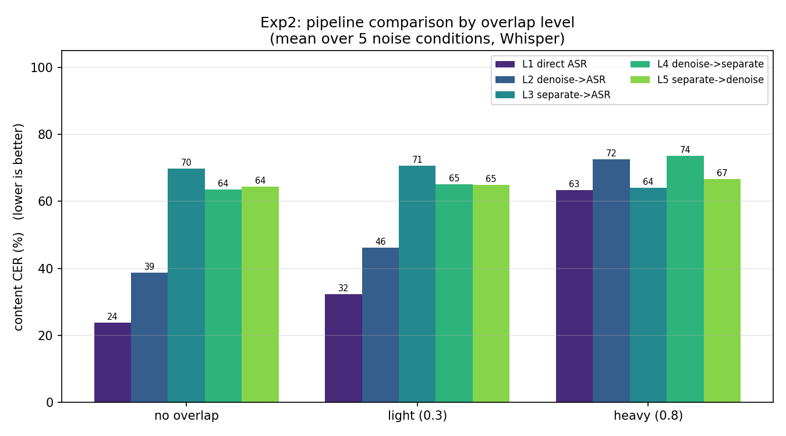
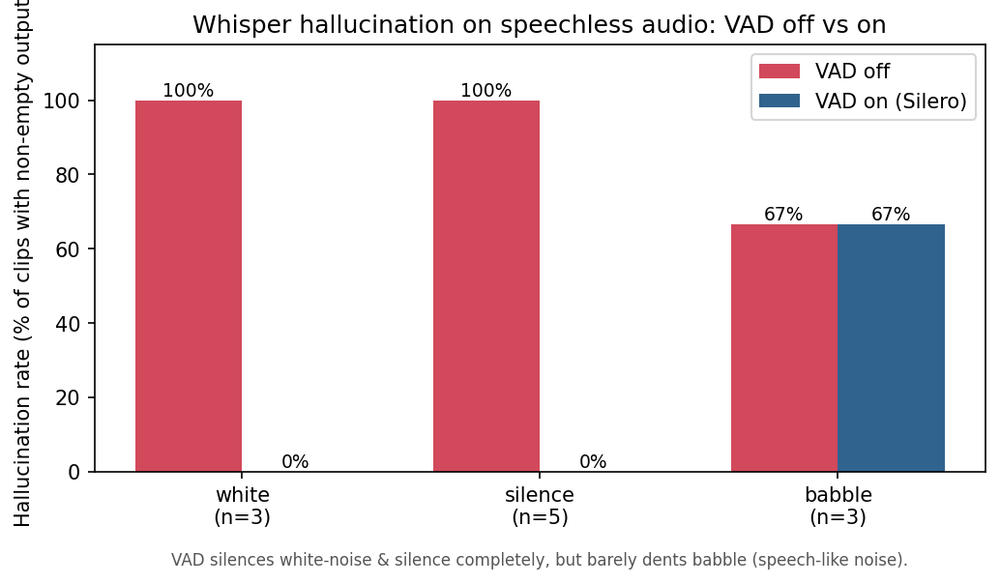
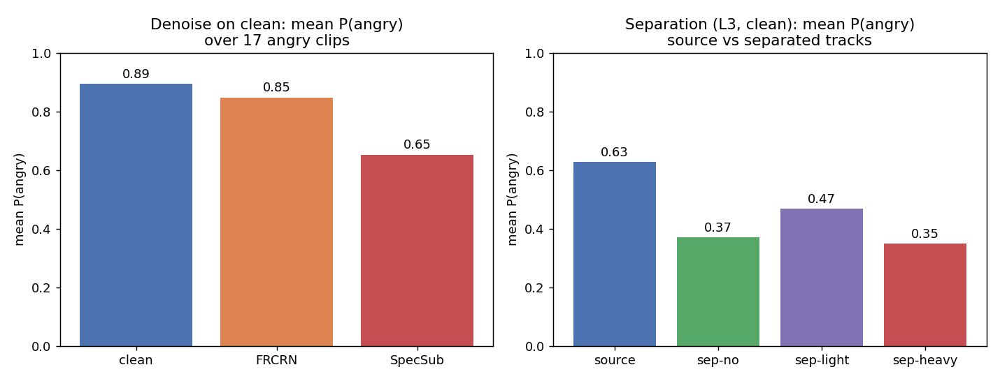
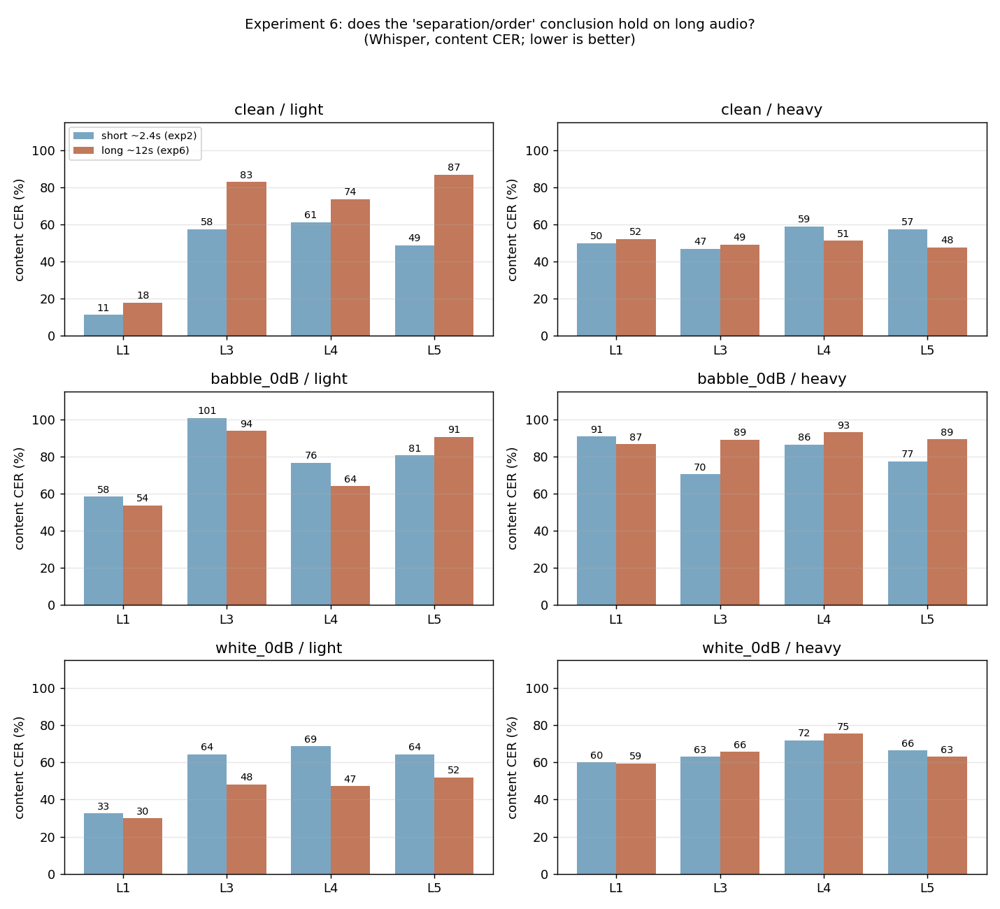
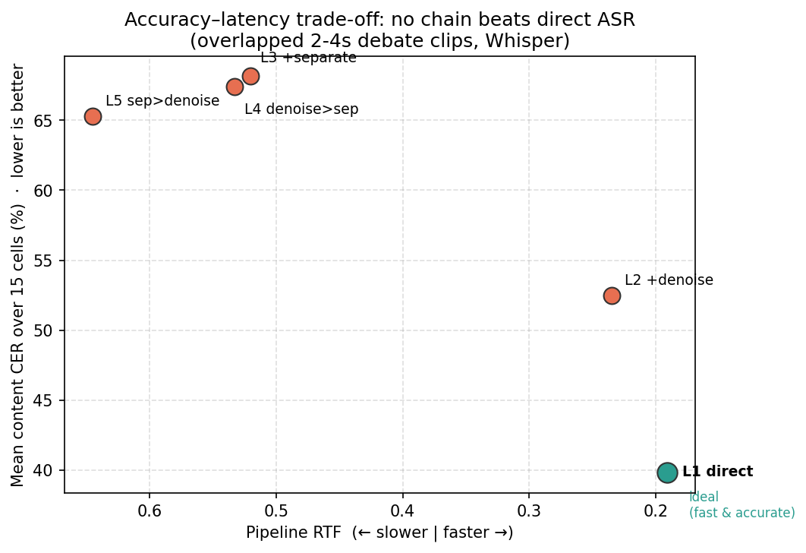
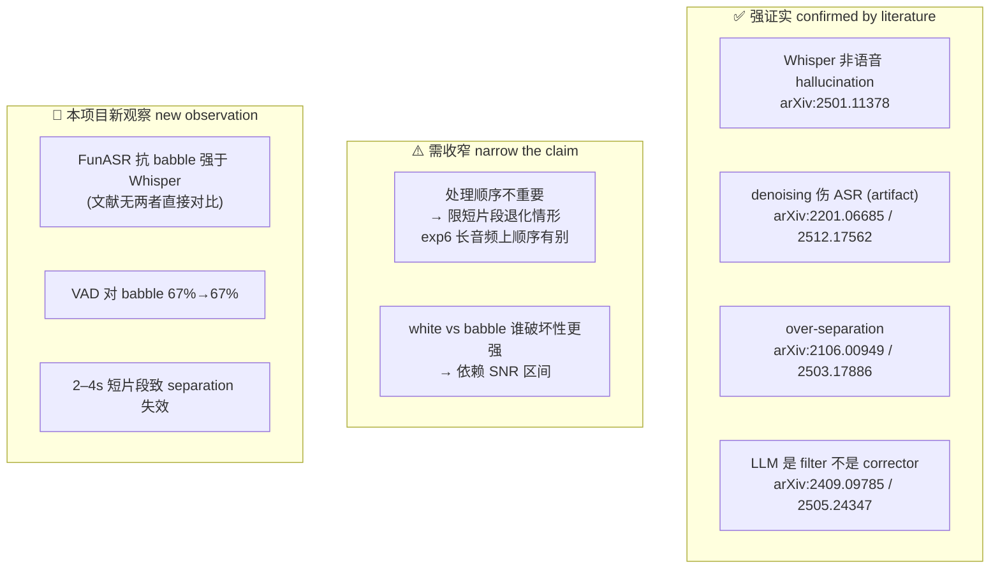

# 噪声与重叠语音场景下本地音频预处理对 ASR 鲁棒性的影响研究

**When Does Audio Preprocessing Help ASR? A Study of Front-End Robustness in Noisy and Overlapped Speech**

---

## 摘要 Abstract

现代大规模弱监督 ASR 已在海量含噪语音上训练，具备相当强的内生抗噪能力。这使得工程上「先降噪、先分离，再识别」的前端预处理直觉需要被重新检验：当后端模型本身足够强时，额外的 front-end 处理究竟是在补偿退化，还是在引入新的 distribution shift 与 processing artifact？已有文献多在单一数据域或 clean 条件下讨论某一类处理，缺乏在 noisy 与 overlapped 同时存在、且以统一口径横向比较多条处理链路的系统检验。

本文以「辩论赛 AI 书记员」为载体场景——其中抢话对应 overlapped speech、观众起哄对应 background noise——在两个异构 ASR backend（faster-whisper large-v3 与 FunASR paraformer-zh）上，对 denoising、speech separation、VAD 与 LLM-based correction 四类前/后端组件做受控 ablation study。评测同时采用字符错误率（CER）与 real-time factor（RTF），以便在 accuracy 与 efficiency 两个轴上衡量每一层处理的净效果及其适用边界。

主要结论有三。**【前端收益边界】** 其一，在 2–4 秒短片段、低 SNR、真实重叠的约束下，多数复杂前端处理呈现负收益：最简单的 direct ASR 在 15 个重叠条件中有 13 个取得最低 CER；denoising 仅在 `FunASR × white noise × 低 SNR` 这一窄条件下稳定取得正收益，speech separation 仅在 heavy 同步重叠下有限抵消额外代价，而 LLM 后处理的可靠价值在于识别并拒绝 hallucination，而非恢复声学上已经丢失的字词。**【模型差异】** 其二，两个 backend 的 noise robustness profile 恰好相反——Whisper 对 babble 更敏感、FunASR 对 white 更敏感，二者的退化曲线在 0 dB 附近交叉——这一对照说明，若只用单一模型，很容易把某个模型的弱点误判为 ASR 的普遍弱点。**【代价外溢】** 其三，预处理的代价不止于文字准确率：denoising 与 separation 会系统性削平 angry 等 paralinguistic 情绪信息。全文所有结论均给出对应的 failure case 与公开文献对照，并明确区分哪些属于对已有结论的证实、哪些需要收窄表述、哪些是本项目的新观察。

---

## 1. 引言与动机 Introduction

### 1.1 场景与叙事

本文把研究问题安置在一个具体而完整的应用场景中：辩论赛的「AI 书记员」。该系统需要在两位辩手抢话（overlapped / cross-speech）、观众起哄（background noise）的条件下，准确记录「谁在什么时候说了什么」。选择这一场景并非出于修辞，而是因为它天然同时包含了课程给出的两个研究方向：Topic 3 关注的本地音频预处理，以及 Topic 1 关注的 speech separation、speaker labeling 与 LLM × ASR 协同。换言之，噪声与多说话人重叠在该场景中并非两个孤立问题，而是必须同时应对的共存退化，这也使它成为检验前端处理价值的合适试验台。

### 1.2 为什么这个问题值得研究

工程实践中存在一条几乎被默认的 pipeline 直觉：音频一旦受到噪声污染，就应当先 denoise 或 separate，再交给 ASR。这条直觉在传统 ASR 时代有其合理性，但在大规模弱监督模型出现后已不再不言自明。以 Whisper 为代表的现代 ASR 在数十万小时含噪语音上训练，其声学前端已隐式吸收了大量噪声与口音变化；此时再人为施加一层增强或分离，输入分布反而可能偏离模型训练时所见的分布，或被增强模型自身的伪影污染。由此产生一个尚未被充分检验的问题：当 ASR backend 已经足够强时，额外的 front-end 处理到底是在提升识别质量，还是在引入 distribution shift 与 processing artifact，从而造成额外退化？这是一个适合用 ablation 与 failure analysis 系统回答的问题，而不能以「采用某一模型后效果尚可」作为充分论证。

### 1.3 本文贡献

本文的贡献可归纳为三点。

1. **【贡献一：补充噪声维度】** 在重叠语音研究中补上「噪声」维度。学长工作（`xutong_paper.pdf`）聚焦 clean 条件下的 speech separation、speaker labeling 与 LLM 修正；本文补上 noise 与 overlap 共存这一更贴近真实的退化场景，并把「什么时候不该处理」作为与「什么时候应当处理」同等重要的问题加以研究。
2. **【贡献二：统一消融口径】** 在统一口径下系统比较五条处理链路（L1–L5）：direct ASR、denoise→ASR、separate→ASR、denoise→separate→ASR、separate→denoise→ASR。我们用一致的评测协议量化每一层处理的净效果与其窄适用边界，而非孤立地展示单条 pipeline。
3. **【贡献三：形成链路选择规则】** 给出可操作的、规则化的链路选择建议，并报告若干 counter-intuitive findings，逐条对照公开 literature，区分「证实 / 收窄 / 新发现」三种关系，使每一条结论都可追溯到数据与文献。

---

## 2. 项目过程与设计迭代 Research Process and Design Iteration

本节说明实验设计的演化过程。本项目并非一开始就确定了现在的实验方案，而是经历了一个研究型迭代：先提出直觉假设，用小规模实验验证流程，再依据失败案例不断修正数据、模型与评测口径。记录这一过程的意义在于说明这些实验为何如此设计，而不仅在于报告最终数字。

### 2.1 前期：问题定义与初始假设

项目最初的总问题是：在噪声与多人重叠语音条件下，哪些本地预处理（denoising / VAD / separation）能够实质性提升 ASR，哪些反而有害？这一问题源于一个自然的工程直觉——音频受到污染后，似乎就应先完成增强或清理再交给 ASR。但该直觉在现代大模型 ASR 上并不必然成立，因为 Whisper 等模型本身已在大量含噪语音上训练过，额外的前端处理可能引入 artifact 或 distribution shift。

据此，我们在 2026-06-10 的实验日志中写下三个初始假设：其一，SNR 从 15 dB 降到 0 dB 时，Whisper 与 FunASR 的 CER 应当上升；其二，babble 这类人声背景噪声可能比 white noise 更伤 ASR；其三，在 noise 与 overlap 共存时，先降噪还是先分离会影响最终识别效果。后续实验并未简单「证明」这些假设，而是逐步把它们改写得更精确：babble 是否更难取决于 ASR backend；处理顺序在短片段上看不出来，但在更长音频与轻重叠条件下会显现。

| 初始假设 | 当时的理由 | 后续结果 |
|---|---|---|
| SNR 越低，CER 越高 | 能量掩蔽增强，目标语音更难听清 | 基本成立，两个 backend 都随 SNR 降低而退化 |
| babble 比 white 更难 | babble 同时包含人声干扰和 informational masking | 需要收窄：Whisper 对 babble 更敏感，FunASR 对 white 更敏感 |
| 先降噪再分离可能更稳 | 分离器面对更干净输入时可能更容易工作 | 短片段中被 separation 失效掩盖；exp6 拉长后轻重叠 6/6 支持 L4 |

### 2.2 数据准备与 ground truth 校对

数据最初来自学长项目中的中文辩论短片段。我们先用 Whisper large-v3 为 clean 片段生成草稿转写，再人工逐条听音校对，最终写入 `refs/`。这一步至关重要：若直接把 Whisper 草稿当作 reference，clean / Whisper 的 CER 会被构造性地压到 0，评测将偏向被测模型之一。因此日志中第一轮数字明确标注为「流程验证，不可作为最终结论」，直到完成人工校对后才重算完整噪声矩阵。

这一过程也改变了我们对数据规模的判断。原计划希望每条音频更长，但实际 clean 片段多为 2–4 秒；这一限制后来成为 separation 失败与 exp6 length ablation 的重要背景。换言之，短片段并非报告后期补写的解释，而是在数据准备阶段就已暴露的约束，并直接影响了后续实验设计。

### 2.3 工具选择与调整过程

组件选型并非直接沿用某一既有 pipeline，而是在候选方案、运行条件、可复现性与变量控制之间反复权衡后的结果。下表汇总各组件的取舍过程。

| 组件 | 初始考虑 | 遇到的问题或取舍 | 最终选择 | 理由 |
|---|---|---|---|---|
| ASR backend | Whisper 系列 | 单模型结论可能只是模型特性 | faster-whisper large-v3 + FunASR paraformer-zh | 用 Whisper 与非 Whisper 的异构 backend 贯穿实验，避免把单模型弱点误判为通用规律 |
| Whisper pipeline | WhisperX / faster-whisper | WhisperX 的 alignment / diarization 对 2–4 s 短片段收益有限，且 VAD 被绑定进 pipeline | faster-whisper | 速度更适合本机 GPU，也便于把 VAD 当独立变量研究 |
| Denoising | DeepFilterNet / FRCRN / spectral subtraction | DeepFilterNet 在 Python 3.12 下缺少可用 wheel，源码安装需 Rust，复现成本高 | FRCRN + spectral subtraction | 一个 neural 方法 + 一个 DSP 方法，依赖更稳定，也能比较“频谱重构”和“能量削减”的差别 |
| Speech separation | SepFormer / MossFormer2 | SepFormer 在中文重叠片段上两路输出几乎相同，明显失败 | MossFormer2 | 与学长工作更接近，且在自制完全重叠样本上能分出相关性较高的两路 |
| LLM correction | 直接改写 ASR 文本 | 直接改写可能生成未说内容，无法恢复声学上已丢失的信息 | LLM as filter | 主要用于识别和拒绝 hallucination，而不是承诺“修正所有错词” |

### 2.4 中期：失败案例如何改变实验设计

项目中最重要的一次转向来自 separation 失败。最初我们尝试用 SepFormer 处理学长的真实 `MidOverlap.wav`，但两路输出的 ASR 文本几乎相同，说明模型并未真正把两个人声分开。换用 MossFormer2 后，真实重叠片段仍不稳定；但在自制的 `pro_001 + con_001` 完全重叠样本上，两路输出与源音频的相关性达到 0.82 / 0.79，说明模型与运行环境本身并非完全不可用。

这一失败促使我们把实验 2 的主数据改为自制可控重叠样本：把 con_i 与 pro_i 按 0 dB SIR 和不同重叠比例错位混合。如此每个 speaker 都有 ground truth，可以严格计算 content CER 与 per-speaker CER，而学长的真实重叠样本则转为定性 failure case。这一改变让实验从「演示一个分离系统」转向「受控检验什么时候应该分离、什么时候不该分离」。

另一处关键转向来自 denoising。DeepFilterNet 的安装问题让我们放弃了这一候选，但这并非单纯的工具替换，而是强化了项目对可复现性的要求。最终采用 FRCRN 与 spectral subtraction，虽未覆盖所有最新增强模型，却能稳定完成完整实验矩阵，并形成 neural 与 DSP 的对照。

### 2.5 后期：补充实验如何回应边界问题

实验 2 的初步结论是：在 2–4 秒短片段中，L4（denoise→separate）与 L5（separate→denoise）没有稳定差异。若直接把它写成「处理顺序不重要」，便会过度外推。结合 per-speaker CER 高达 84–88% 的事实，更合理的解释是：短片段上 separation 本身已大面积失败，失败组件的前后顺序自然难以显现。

因此我们在后期加入实验 6，把同一角色的多条片段拼接到约 12 秒，重新运行 L1/L3/L4/L5，并引入 Whisper 与 FunASR 双 backend。结果显示：在轻重叠条件下，L4 在 clean / babble / white 三种噪声、两个 backend 上 6/6 胜过 L5。这说明 H3 并非完全错误，而是在短片段退化条件下被掩盖；当音频长度给 separation 留出空间后，处理顺序的边界条件才显现出来。这正是本项目想呈现的研究过程：负结果不是终点，而是用来定位边界、修正假设并设计下一轮实验的依据。

---

## 3. 相关工作 Related Work

本节把项目涉及的五条技术线与公开文献对接，并指出每条与本项目的关系。结论级的逐条对照见 `results/literature_support.md`（已列 12 篇主要来源）。

### 3.1 鲁棒 ASR 与 Whisper hallucination

Whisper 通过约 68 万小时弱监督训练，获得对 ambient 与 white noise 的较强鲁棒性（Robust Speech Recognition via Large-Scale Weak Supervision, arXiv:2212.04356），其噪声鲁棒性甚至强到可兼作 audio event tagger（Whisper-AT, arXiv:2307.03183）。然而同一套生成式 decoder 在 non-speech 或低置信音频上会产生 hallucination：arXiv:2501.11378 的系统性分析指出，约 35% 的幻觉集中在少数固定短语，而非随机分布；OpenAI 社区也记录了由字幕训练数据污染导致的 `Amara.org`、"like and subscribe" 等固定输出（openai/whisper Discussion #928）。这一现象直接对应本文 exp4 的观察，也解释了为何 babble 类人声噪声对 Whisper 尤其危险——它最容易被 decoder 误判为可解码的语音。

### 3.2 Speech enhancement / denoising 对 ASR 的影响

「降噪一定有利于识别」并不成立。arXiv:2201.06685（How Bad Are Artifacts?）用 orthogonal projection 把增强误差分解为噪声残差与人为伪影两部分，证明真正主导下游 ASR 退化的是 enhancement artifact 而非残余噪声；arXiv:2512.17562（When De-noising Hurts，医疗 ASR）进一步报告 40 个配置在引入降噪后全部变差。这两项工作构成本文「高级前端不一定划算」主论点的核心文献依据，也预示了 exp1 中 clean 音频经降噪后 CER 反升的结果。

### 3.3 Speech separation 与 over-separation

arXiv:2106.00949（Should We Always Separate?）的标题几乎就是本文的问题：它主张依据「是否真的存在重叠」动态决定是否分离，以避免在非重叠段过度分离产生 artifact；arXiv:2503.17886 则指出，把 separation front-end 接在 clean-trained ASR 之前会劣化识别。两者共同对应 exp2 观察到的 over-separation 现象。

### 3.4 LLM-based generative error correction (GER)

arXiv:2409.09785 给出 GER 的 challenge 与 baseline，明确指出 text-only 改写无法恢复解码时已丢失或被剪枝的 acoustic 信息，且完全改写会虚构未说内容；arXiv:2505.24347 则用三阶段验证与 logit-space anchoring 专门抑制 GER 幻觉。这与本文 exp3 的结论一致：LLM 是 filter 而非 corrector。

### 3.5 Speech Emotion Recognition (SER)

我们用 emotion2vec 系列的自监督 SER 表征模型评估「预处理是否抹平情绪」，作为 paralinguistic 维度补强主论点（见 exp5）。所用模型（emotion2vec、Paraformer/FunASR、MossFormer2、FRCRN、SepFormer、Conv-TasNet、DeepFilterNet）的原始论文引用编号已核实补全，见 References。

### 3.6 前人工作及其局限

学长工作（`xutong_paper.pdf`）建立了「speech separation → speaker labeling → LLM 语义修正」的 clean-condition pipeline，验证了该思路在干净条件下的可行性。本文在其基础上识别出三处可深入的局限。首先是噪声维度的缺失：该工作未系统考察 background noise，尤其是 babble 类人声噪声，如何同时破坏 ASR、separation 与 speaker attribution。其次是缺少「是否应当处理」的判据：它默认采用「分离→识别」流程，未检验在非重叠或短片段上分离是否反而有害（over-separation）。第三是缺少 front-end trade-off 视角：未把 RTF、处理顺序与 artifact 风险纳入 accuracy–efficiency 权衡。本项目正是围绕这三点展开。

---

## 4. 研究问题与假设 Problem Statement and Hypotheses

为使总问题可证伪，我们在立项阶段就把它拆解为五个可检验的 hypothesis，并在实验完成后逐条标注「证实 / 推翻 / 收窄」。总问题是：在 noise 与 multi-speaker overlap 条件下，哪些本地预处理真的能提升 ASR，哪些反而有害？下表给出五个假设及其检验结果。

| # | 研究问题 | 假设（立项时） | 检验结果 |
|---|---|---|---|
| H1 | noise degradation | SNR 15→5→0 dB 时 CER 单调上升；babble（人声背景）比 white 伤害更大 | **【部分证实，需收窄】**：单调上升成立；white vs babble 的相对难度**依赖 SNR 区间**，仅在低 SNR / 交叉点附近 babble 对 Whisper 的破坏性更强（exp1） |
| H2 | denoising benefit | 降噪在低 SNR 有益，高 SNR 因 artifact 反而有害 | **【证实】**：仅 `FunASR × white × 低 SNR` 稳定取得正收益；clean/高 SNR 降噪普遍有害（exp1） |
| H3 | processing order | noise + overlap 并存时，先降噪 vs 先分离对结果有显著影响 | **【先否后立：边界定位，双引擎佐证】**：短片段上 L4/L5 无稳定差异（degenerate case）；exp6 拉长到 ~12 s 后顺序差异显现——**轻重叠先降噪(L4)，Whisper+FunASR 6/6 一致**（详见 7.7 / 9.3） |
| H4 | LLM correction boundary | LLM 能修术语/格式，但无法修复 acoustic 已丢失的错误 | **【证实】**：LLM 唯一可靠价值是拒绝 hallucination，通顺错词无法修复（exp3） |
| H5 | engineering trade-off | 更复杂的链路不一定值得，存在低成本接近最优的方案 | **【证实】**：direct ASR 在 15 个重叠条件中 13 个最优（exp2 + ablation） |

这套假设贯穿后续全部实验：exp1 检验 H1/H2，exp2 检验 H3/H5，exp3 检验 H4，exp4–exp6 则分别从 hallucination 机理、paralinguistic 代价与音频长度边界三个角度补强或修正上述结论。

---

## 5. 系统设计与方法 Methodology

本节给出系统的整体设计与各组件的选型依据。每个组件均按「候选空间 → 评估标准 → 实测遇到的问题 → 最终选择 → 依据」的逻辑展开，以说明选型是在反复试验与失败中收敛的结果，而非一次性确定的主观选择。

### 5.1 整体 pipeline

系统总架构如图 5.1，从音频输入经 audio probe、front-end、separation、ASR、speaker label、LLM post 直到 evaluation，每一环都可独立开关，以便单独度量其净效果。

**图 5.1 系统总架构**（Mermaid 源图）：



exp2 的核心 ablation 由图 5.2 给出的五条链路构成：L1 为 direct ASR，L2/L3 各加一层降噪或分离，L4/L5 则在两层都加的前提下交换处理顺序。这一设计使我们能够分别隔离「单层处理的净效果」与「处理顺序的效果」。

**图 5.2 五条对比链路 L1–L5**（exp2 的核心 ablation）：



图 5.1 与图 5.2 为 Mermaid 源图，可在支持 Mermaid 的查看器中直接渲染；导出 PDF 或放入 slides 时，建议用 mermaid-cli 或 draw.io 渲染为 PNG 后替换。

### 5.2 ASR backend 选型

候选空间包括 openai-whisper、faster-whisper、WhisperX、wav2vec2、Conformer 与 FunASR (Paraformer)。评估标准是：中文短片段 CER、可在 6 GB laptop GPU 上运行、RTF 可接受，以及能够单独控制变量（尤其是把 VAD 开关作为 exp4 的自变量）。

之所以选 faster-whisper 而非 WhisperX，是因为 WhisperX 本质上是 faster-whisper 叠加强制 VAD、forced alignment 与 diarization，其增益主要面向长音频的时间对齐与说话人分离；而本文的研究对象是 2–4 秒短片段，并不需要 alignment 或 diarization，且 exp4 要把 VAD 当作可开关的自变量单独研究——若用 WhisperX 把 VAD 固化在 pipeline 中，反而会失去对该变量的控制。faster-whisper 基于 CTranslate2，int8_float16 量化使 large-v3 能在 RTX 4050 Laptop 6 GB 上稳定运行（RTF ≈ 0.2–0.3），是更合适的底层引擎。

在 Whisper 之外再加入 FunASR (paraformer-zh)，目的是引入一个非 Whisper 的异构对照，以检验「noise robustness 是模型特性还是普遍规律」。这一决定后来直接支撑了项目最重要的反直觉发现——两个 backend 的弱点恰好相反（见 7.1）；若只用单一模型，便会把「Whisper 的弱点」误当成「ASR 的弱点」。最终选择为 faster-whisper large-v3 (int8_float16) 与 FunASR paraformer-zh 双引擎贯穿全程。

### 5.3 denoising 方法选型

候选空间包括 DeepFilterNet（neural）、FRCRN（neural）与 spectral subtraction / spectral gating（DSP, `noisereduce`）。评估标准是：neural 与 DSP 各取一个代表以形成对照，且零新增重依赖、可在现有环境复现。

实测中，最初选定的 DeepFilterNet 在 Python 3.12 下没有可用的 `deepfilterlib` wheel，源码安装需引入 Rust 工具链，会显著扩大依赖复杂度并威胁可复现性。我们据此改用 ClearVoice 自带的 FRCRN_SE_16K 作为 neural 代表，spectral subtraction 作为 DSP 代表。设计上的一个关键决定是让 clean 音频也过一遍降噪——这并非为了模拟噪声，而是为了证伪式地检验 H2：若高 SNR 条件下降噪仍能降低 CER，则 artifact 假设不成立。实测结果是 clean 降噪普遍有害（Whisper 4.9% 升至 9.3% / 14.7%），正向支持了「artifact 是退化主因」这一论点。最终选择为 FRCRN（neural）与 spectral subtraction（DSP）双路对照。

### 5.4 speech separation 选型

候选空间包括 Conv-TasNet、SepFormer 与 MossFormer2。评估标准是：能处理中文重叠、预训练可直接推理、输出可用 ASR 或相关性验证。

实测中出现了一个重要的 failure case。我们先用 SepFormer（sepformer-wsj02mix，英文 8k 训练）分离学长的真实 `MidOverlap.wav`，两路输出内容高度雷同，据此判定分离失败，怀疑根因是 domain mismatch（英文训练对中文测试）。改用 MossFormer2（ModelScope 中文）后，真实 `MidOverlap.wav` 仍不稳定，但在自制完全重叠样本上能分出与两源相关性 0.82 / 0.79 的两路。由此产生一个数据决策：后续 overlap 定量实验改用自制可控重叠样本（con_i 与 pro_i 等响度 0 dB SIR 错位混合，重叠 ratio 取 0 / 0.3 / 0.8），以保证每个 speaker 都有 ground truth；学长的真实重叠样本则转为定性 failure case。这是一项为保证 ground truth 可控而主动调整数据方案的研究决定，而非任意性选择。最终选择为 MossFormer2，配自制可控重叠数据。

### 5.5 VAD、SER、LLM 的选型

VAD 采用 faster-whisper 内置、可开关的 Silero VAD，目的是把它作为 exp4 的自变量（on/off 对照）而非默认开启。SER 采用 `iic/emotion2vec_plus_large`，它与已用的 paraformer-zh / MossFormer2 / FRCRN 同属 FunASR/ModelScope 栈，零新增依赖即可复用已落盘的处理前后音频做情绪漂移对比。LLM correction 采用 claude-opus-4-8（中转 API），在盲测条件下（纠错时不提供 reference）对照「无纠错 / 纯 LLM / hotword-aided」三档。

### 5.6 评测口径设计

评测采用 CER 而非 WER：测试语料为中文，故采用字符级编辑距离（jiwer，去标点与空白）。RTF 定义为处理耗时除以音频时长，分环节记录（denoise RTF / separate RTF / ASR RTF），链路 RTF 为各环节相加。在 speaker attribution 上，我们用 per-speaker CER（以 permutation 取最优配对）替代人工标注的 attribution error rate；因为 separation 普遍失败、两路常常复制混合，人工标注 attribution 已失去意义。

需要特别声明跨实验的数据域：exp1（域 A，单说话人降噪）、exp2（域 B，重叠分离）、exp3（域 C，LLM 纠错）的绝对 CER 不可跨行直接比较，跨行只比较「净效果方向」。详细口径声明见 `results/ablation_summary.md`。

---

## 6. 实验设置 Experimental Setup

下表汇总语料、噪声、backend、front-end、硬件与指标的完整设置。语料以人工校对的中文辩论短片段为主，噪声与重叠均为可控合成，并辅以 6 条真实手机录音作泛化抽查。

| 项 | 设置 |
|---|---|
| clean 语料 | 26 条中文辩论短片段，2–4 s，16 kHz mono，人工校对转写存 `refs/`（草稿来自 Whisper，逐条听音校正，避免偏向 Whisper） |
| overlap 语料 | 自制：con_i↔pro_i 等响度 0 dB SIR 错位混合，ratio {0, 0.3, 0.8}；另有学长 5 条真实重叠作定性对照 |
| noise | white（synthetic）+ babble（英文语音错位叠加，与中文目标无文本泄漏）；SNR {15, 5, 0} dB，实测 SNR 误差 0.000 dB |
| real 录音 | 6 条真实手机录音（dorm / canteen / classroom / discussion ×3） |
| backend | faster-whisper large-v3（int8_float16）、FunASR paraformer-zh |
| front-end | FRCRN_SE_16K、spectral subtraction、Silero VAD、MossFormer2 |
| SER | emotion2vec_plus_large |
| 硬件 | RTX 4050 Laptop 6 GB |
| 指标 | CER、RTF、per-speaker CER、hallucination case |

数据生成与运行脚本见 `src/`（`make_noises.py` / `add_noise.py` / `make_overlap.py` / `run_asr.py` / `denoise.py` / `separate.py` / `evaluate.py` 等），最小复现步骤见 `README.md`。

---

## 7. 实验结果 Experiments and Results

以下六组实验依次检验前述假设。各实验先说明所测假设与设计动机，再给出数据表，随后结合 failure case 解释其机理；数字以 `results/` 为准。

### 7.1 实验 1：noise × denoising × ASR（域 A）

实验 1 检验 H1 与 H2，即噪声本身如何使 CER 退化，以及降噪能否补偿这种退化。设置上，我们对 26 条 clean 片段施加 {white, babble} 两种噪声、{15, 5, 0} dB 三档 SNR，并令 clean 片段同样过一遍降噪（用于证伪式检验 H2）；每种条件分别在不做处理、FRCRN 与 spectral subtraction 三种降噪下，由 Whisper 与 FunASR 两个 backend 识别。表 7.1 给出各条件的 CER（格式为 `none → FRCRN → specsub`），完整数据见 `results/asr_raw.csv` 与 `results/summary.csv`。

| 条件 | Whisper | FunASR |
|---|---|---|
| clean | 4.9 → 9.3 → 14.7 | 10.1 → 8.5 → 13.0 |
| white 15 dB | 7.4 → 16.6 → 14.4 | 9.6 → 12.0 → 14.6 |
| white 5 dB | 12.2 → 33.2 → 32.3 | 29.4 → 17.0 → 16.8 |
| white 0 dB | 41.9 → 49.9 → 61.7 | **68.4 → 27.5** → 40.1 |
| babble 15 dB | 5.4 → 17.0 → 19.0 | 8.5 → 12.7 → 16.1 |
| babble 5 dB | 20.6 → 78.6 → 47.1 | 22.3 → 52.3 → 30.1 |
| babble 0 dB | 71.7 → 92.5 → 83.7 | 43.3 → **95.1** → 46.2 |

就效率而言，spectral subtraction 的 RTF ≈ 0.018，FRCRN ≈ 0.105，后者耗时约为前者的六倍。退化曲线与热力图分别见 `results/exp1_denoise_curves.png` 与 `results/exp1_denoise_heatmap.png`，典型案例见 `results/exp1_cases.txt`。





结果呈现出几个一致的模式。**【边界一：降噪非稳定增益】** 在七个噪声条件中，降噪只在 `FunASR × white × 低 SNR` 一格大幅取得正收益（0 dB 下 68.4 降到 27.5），其余条件多为负收益。**【边界二：babble 与 neural denoise 的耦合风险】** FunASR 在 babble 0 dB 下经 FRCRN 处理后 CER 由 43.3 升到 95.1，几乎完全不可用。其机理在一个 failure case 中清晰可见：`babble_0dB / FunASR / FRCRN / con_001.wav` 原本尚能识别出部分中文，FRCRN 却把目标中文当作背景人声删除，残留的英文背景反而主导了识别输出。**【边界三：高 SNR 也可能被处理损伤】** clean 片段经降噪后普遍变差（Whisper 4.9% 升至 9.3% / 14.7%），直接证伪了「高 SNR 条件下仍应降噪」，正向支持了 artifact 主因论。最后，「neural 一定优于 DSP」同样不成立：FRCRN 与 spectral subtraction 谁更优，取决于噪声类型与 backend，而非可以做一般化判断。

### 7.2 实验 2：noise + overlap × 处理顺序（域 B）

实验 2 检验 H3 与 H5，即在噪声与重叠共存时五条处理链路 L1–L5 的相对优劣，以及处理顺序是否重要。数据采用自制可控重叠（ratio {0, 0.3, 0.8}）叠加 {babble, white} × {5, 0} dB（外加 clean）。表 7.2 报告各链路在 15 个重叠 cell 上的平均 content CER，明细见 `results/exp2_summary.csv` 与 `results/exp2_pivot.md`。

| 链路 | content CER | spk CER | 15 格最优数 |
|---|---|---|---|
| L1 direct | **39.8** | — | **13** |
| L2 denoise→ASR | 52.5 | — | 0 |
| L3 separate→ASR | 68.2 | 88.1 | 2（均 heavy） |
| L4 denoise→separate | 67.4 | 84.9 | 0 |
| L5 separate→denoise | 65.3 | 85.2 | 0 |

链路 RTF 方面，specsub 约 0.018、separate 约 0.13、Whisper 约 0.2，因此含分离的链路耗时约为 L1 的二至三倍。**【核心现象：over-separation】** L1 在 15 个 cell 中有 13 个取得最低 CER，分离链路仅在 heavy 重叠下才偶尔取得正收益（clean / heavy 由 50.0 降到 46.9）。per-speaker CER 始终维持在 84–88%，说明 MossFormer2 对 2–4 秒短片段未能有效完成分离——两路输出常常是整句混合的复制。正因为 separation 在此条件下已经失效，仅交换处理顺序的 L4 与 L5 之间看不出稳定差异；这意味着 H3 在该条件下被推翻，但属于 degenerate case，其根因将在 7.7 通过拉长音频进一步定位。两类 failure 印证了上述判断：轻度重叠下分离器把单路内容复制成两路；0 dB babble 下分离出的两路又都触发了 Whisper hallucination。

图 7.2 在五个噪声条件上取均值（Whisper），直观呈现 over-separation 随重叠程度的变化；绘图脚本见 `src/plot_exp2.py`。



如图所示，no-overlap 时 L1（23.8%）远低于分离链路 L3/L4/L5（约 64–70%）；随重叠加重，L1 的优势收窄，到 heavy 时 L1（63.3%）已与 L3（64.0%）基本持平，分离仅在个别 heavy cell 反超。换言之，分离只有在重叠最严重时才可能追平差距，多数条件下主要增加 artifact 与耗时。

### 7.3 实验 3：LLM-based generative correction（域 C）

实验 3 检验 H4，即 LLM 后处理的能力边界。我们从 exp1 / exp2 中选取五条代表性错误（两条术语错、一条近音错、一条综艺幻觉、一条字幕幻觉），在盲测条件下（纠错时不提供 reference）对照「无纠错 / 纯 LLM / hotword-aided」三档，纠错模型为 claude-opus-4-8。表 7.3 给出各案例的 content CER，明细见 `results/exp3_correction.md` 与对应 `.csv`。

| 案例类型 | raw | 纯 LLM | hotword |
|---|---|---|---|
| 术语错·通顺（好意） | 0.158 | 0.158 | 0.158 |
| 术语错·声学差远（玩具） | 0.40 | 0.40 | **1.0** |
| 近音错（说/多） | 0.077 | 0.077 | 0.077 |
| 综艺幻觉 | 2.286 | **0.571** | 0.571 |
| 字幕幻觉 | 1.579 | **0.842** | 0.842 |

结果指向一条清晰的边界。**【LLM 的可靠作用：过滤而非修复】** LLM 唯一可靠的价值是识别并拒绝 hallucination：它能在综艺幻觉（2.286 → 0.571）与字幕幻觉（1.579 → 0.842）上把虚构内容替换为 `[无法识别]`，而不是继续生成缺乏声学证据支持的内容。但对于声学上已经丢失、却在文本层面通顺的错词，LLM 无能为力（术语错·通顺一例三档均为 0.158，近音错三档均为 0.077）。hotword 不仅没有增益，在声学差距过大时还会产生负效应：当目标词与识别结果声学相去甚远，hotword 无法在两者之间建立有效约束，「玩具」案例反而从 0.40 升到 1.0。概括而言，在本文场景下，LLM 是 filter 而非 corrector。

### 7.4 实验 4：Whisper hallucination 与 VAD 边界

实验 4 检验一个更细的机理假设：non-speech 或低置信音频会诱发固定模式的 hallucination，而 VAD 能抑制这一现象但存在边界。我们向 Whisper 喂入纯噪声与静音段（`data/exp4/`），并做 VAD on/off 对照，明细见 `results/exp4_hallucination.csv` 与 `.md`，对比图见 `results/exp4_vad_compare.png`。



在关闭 VAD 时，hallucination rate 约为 91%；开启 VAD 后，white 与 silence 上的幻觉被完全压制（100% → 0%），但 babble 几乎不受影响（67% → 67%）。幻觉内容是固定模式而非随机：反复出现字幕平台残留的 `Amara.org`、「请不吝点赞订阅」以及字幕组署名，这与 arXiv:2501.11378 高度一致。VAD 之所以无法抑制 babble，是因为它把「类语音」的连续 babble 判为语音而予以放行——这恰好是 babble 0 dB 在 exp1 / exp2 中造成较大破坏的根因，而 67% → 67% 这条曲线是本项目对该机理的直接实证。

### 7.5 实验 5：emotion × preprocessing（paralinguistic 维度）

实验 5 把代价的考察从文字层面延伸到 paralinguistic 层面，检验降噪与分离是否会系统性削平高唤醒情绪（angry），即「为提升可听性而处理」是否同时削弱了「话语如何被表达」这一副语言信息。我们对同一条音频在处理前后各运行一次 emotion2vec，比较其 P(angry)（脚本 `src/run_emotion.py`，明细 `results/exp5_emotion*.csv/.md`，漂移图 `results/exp5_emotion_drift.png`）。



在 17 条 angry 片段上，P(angry) 均值由 clean 的 0.89 降到 FRCRN 后的 0.85（1/17 翻转情绪标签）、再降到 spectral subtraction 后的 0.65（4/17 翻转）；分离造成的表征削弱更明显，源音频 0.63 经 L3 处理后在 no / light / heavy 三档分别降到 0.37 / 0.47 / 0.35。可见预处理会系统性削平情绪，且在本组样本中，separation 对 paralinguistic 信息的削弱强于 denoising，spectral subtraction 的削弱强于 neural denoise。典型案例如 `pro_014` 由 angry 经 specsub 后被判为 neutral、`con_005` 由 angry 被判为 happy。这为主论点补上一层：前端处理不仅可能伤害 ASR，还会削弱情绪线索。

### 7.6 真实录音泛化抽查 Generalization Spot-Check

为检验上述结论是否只是自制数据的产物，我们在 6 条真实手机录音上对 baseline 与最佳链路各运行一遍，做人工 spot-check（无逐字 ground truth，故不强算 CER），明细见 `results/real_asr.csv` 与 `results/real_spotcheck.md`，中间产物存于 `data/real/{raw,denoised,sep_L3,sep_L4}/`。真实录音独立复现了 exp1 / exp2 的全部主结论：direct ASR 表现最稳定；canteen 场景下谱减触发「请不吝点赞订阅」字幕幻觉、L4 触发「中文字幕志愿者」；分离仅在 heavy 同步重叠下取得正收益（找回被 direct ASR 漏识的同步句）；VAD 表现出双刃特性；英文专名稳定转错（支撑 exp3 的 hotword 动机）。该抽查支持上述结论在真实录音上的外推趋势。

表 7.6 列出五个代表性案例，作为 failure analysis 的定性证据——每个案例都对应一个具体的工程边界或错误机制。

| 案例 | 场景 | 现象（一句话） | 支撑的判断 |
|---|---|---|---|
| A | 双人·食堂噪声+重度同步重叠 | **【分离唯一取得正收益】**：直接 ASR 漏识 A 的同步句，分离后某一路找回 | separation 只在 heavy 同步重叠下可能值得 |
| B | 双人·食堂噪声+自然插话 | **【direct ASR 已足够】**：几乎全文转出 | 伤害 ASR 的关键不是“有无噪声”，而是同步重叠时长 |
| C | 双人·安静重叠 | **【分离产生负效应】**：spk2≈整句混合复制、spk1 只剩碎片 | 非必要分离会引入 over-separation artifact |
| D | 单人·食堂强噪 | **【降噪产生负效应】**：谱减伪影末尾凭空冒出“请不吝点赞订阅” | denoising artifact 会诱发 Whisper 字幕式 hallucination |
| E | 单人·教室轻噪 vs 食堂强噪 | **【VAD 具有双刃性】**：轻噪下消掉尾部幻觉，强噪下切掉真实语音中段 | VAD 不是通用修复，而是依赖噪声形态的边界工具 |

### 7.7 实验 6：长音频 length ablation（域 B 边界，验证 H3 根因）

实验 6 回到 H3 的根因问题：exp2 观察到的「处理顺序无稳定差异」，究竟是普遍规律，还是 2–4 秒短片段上 separation 全盘失效（spk CER 84–88%）所致的 degenerate artifact？为此我们把音频拉长到约 12 秒，重新检验两点：(a) separation 是否取得正收益；(b) L4 与 L5 是否出现差异。

数据来源经核实是可靠的。据学长 `xutong_paper.pdf` 表 4.12，con / pro 源自一段 62.4 秒双人辩论质询片段，再人工切分出单人片段——con_* 全为反方一人、pro_* 全为正方一人。因此把同一角色的多条片段拼接，得到的是连贯的真实单说话人，而非人为构造的虚假说话人，双说话人 ground truth 仍严格成立。设置上，`src/make_exp6.py` 复用 `make_overlap.mix_pair`，每角色固定种子拼成约 12 秒，按 {light=0.3, heavy=0.8} 等响度错位混合，覆盖 clean、babble_0dB、white_0dB；对每条运行 L1/L3/L4/L5（去掉不涉顺序的 L2），并同时使用 Whisper 与 FunASR 两个 backend，以验证顺序效应不是单模型特性，降噪用 specsub、分离用 MossFormer2。共 5 样本 × 2 档 × 3 噪声 × 4 链路 × 2 引擎 = 420 条转写。脚本见 `src/{make_exp6,run_exp6,eval_exp6,plot_exp6}.py`，明细见 `results/exp6_{summary.csv,pivot.md}` 与 `data/exp6/manifest.csv`。表 7.7a 给出 Whisper 的 content CER，并以「短片段 → 长音频」对照展示。

| cond | level | L1 | L3 | L4 | L5 |
|---|---|---|---|---|---|
| clean | light | 11.3 → 17.9 | 57.6 → 82.9 | 61.3 → 73.7 | 48.8 → 86.9 |
| clean | heavy | 50.0 → 52.1 | 46.9 → 49.1 | 58.9 → 51.3 | 57.4 → **47.7** |
| babble_0dB | light | 58.3 → 53.6 | 100.6 → 93.7 | 76.5 → **64.0** | 80.5 → 90.6 |
| babble_0dB | heavy | 90.7 → 86.6 | 70.3 → 89.1 | 86.3 → 92.9 | 77.3 → 89.2 |
| white_0dB | light | 32.5 → 29.9 | 64.2 → 48.1 | 68.7 → **47.2** | 64.4 → 51.8 |
| white_0dB | heavy | 60.1 → 59.5 | 63.0 → 65.7 | 71.8 → 75.4 | 66.4 → 63.0 |



处理顺序的差异在长音频上显现出来。表 7.7b 给出 L4 与 L5 的双引擎对照（content CER，数值越小越好）：在 light 重叠的三种噪声 × 两个引擎共六个条件上，结果 6/6 一致偏向 L4（先降噪）。

| cond/level | whisper L4 / L5 | funasr L4 / L5 |
|---|---|---|
| clean/light | **73.7** / 86.9 | **87.6** / 91.5 |
| babble_0dB/light | **64.0** / 90.6 | **51.4** / 99.8 |
| white_0dB/light | **47.2** / 51.8 | **44.3** / 60.0 |
| clean/heavy | 51.3 / **47.7** | 56.1 / **54.6** |
| babble_0dB/heavy | 92.9 / **89.2** | **73.9** / 82.3 |
| white_0dB/heavy | 75.4 / **63.0** | 67.6 / **55.5** |

per-speaker CER（long, Whisper）仅在 clean / heavy 一格降到约 50%，其余多在 75–94%；short 与 long 的对比见 `results/exp6_length.png`。

顺序效应的机理在一个 failure case 中可见：`babble_0dB / light / s2` 条件下，L5（先分离）把带噪混合直接送入分离器，结果 spk1 与 spk2 都坍缩为「中文字幕志愿者 李宗盛」——两路全部退化为字幕 hallucination，彻底失败；而 L4（先降噪）先给分离器一个较干净输入，保留了其中一路真实内容。即降噪前置避免了分离器被噪声诱导出双路幻觉，这正是 L4 在「轻重叠 + 噪声」下大幅领先的原因。

综合来看，实验 6 给出三点结论。**【长音频仍未完全解决分离问题】** separation 在长音频上仍然大面积失败（spk CER 多在 75–94%），说明「短片段难分」并非唯一主因，根本问题是模型对中文重叠语音的分离能力不足。**【处理顺序存在可观测差异】** light 重叠下双引擎 × 三噪声 6/6 一致偏向先降噪（L4），babble 下增益幅度最大（Whisper −27、FunASR −48），heavy 重叠则多数微弱偏向 L5；FunASR 的独立佐证说明顺序效应不是 Whisper 的特性。**【分离收益依赖 backend 弱点】** separation 是否取得正收益取决于 backend 的噪声弱点：Whisper 仅在 clean / heavy 有限取得正收益，FunASR 在 clean / heavy 不取得正收益，却在 white_0dB 大幅取得正收益（L1 的 76.9 / 88.7 降到分离后的 44.3 / 55.5），原因正是 FunASR 本身对 white 更敏感（exp1），这与 exp1「两引擎弱点相反」相互呼应。

据此，H3 应从「degenerate-case 退化观察」升级为经异构引擎佐证的 boundary-condition 定位：在分离全败的短片段上无差异，而在给足时长后顺序确有差异，轻重叠应先降噪（L4），双引擎 6/6 一致——这部分恢复了立项时曾被短片段结果否定的假设（先降噪让分离器更易工作）。需要注意的 caveat 是，每格 N=5 属定性规模，heavy 条件下部分链路已接近性能下限效应、差异不可靠；最强证据是 light 重叠下 L4 优于 L5（双引擎一致）与 FunASR × white 的正收益。

---

## 8. 综合分析 Cross-Experiment Analysis

前面六组实验分别回答了噪声、降噪、重叠、LLM correction、VAD、情绪与长度边界的问题。为避免报告停留在结果枚举层面，本节把这些实验放在一起考察：哪些处理真正有用，哪些只是增加复杂度，以及为什么 direct ASR 会成为如此强的 baseline。

### 8.1 哪些处理真的有用？

实验结果支持一个偏保守的工程结论：前端处理并非越多越好，只有在明确触发条件下才值得加入。多数情况下，direct ASR 不仅最简单，也最稳定、最高效、最少引入 artifact。下表把各实验的结论收敛为按场景的链路建议。

| 场景 | 推荐链路 | 依据 |
|---|---|---|
| clean / no overlap / light overlap | L1 direct ASR | exp2 中 L1 在 15 个重叠条件中 13 个最低 CER；非必要 separation 明显引入 over-separation artifact |
| white noise + low SNR + FunASR | denoise → ASR | exp1 中 `FunASR × white × low SNR` 是 denoising 唯一稳定正收益条件 |
| heavy 同步重叠 | 可尝试 separation | direct ASR 容易漏识同步说话人；separation 在 heavy overlap 中偶尔找回被丢失内容 |
| babble + Whisper | direct ASR，必要时加 VAD 作边界保护 | babble 易诱发 Whisper hallucination；denoising / separation 可能进一步引入伪影 |
| 输出明显无关或字幕式幻觉 | LLM filter | exp3/exp4 显示 LLM 更适合拒绝 hallucination，而不是恢复声学已丢失词语 |
| 需要保留情绪或语气 | 避免过度 preprocessing | exp5 显示 denoising / separation 会削平 angry 等 paralinguistic 信息 |

### 8.2 Accuracy-efficiency trade-off

只看 CER 容易高估复杂链路，因为 denoising 与 separation 都有额外 RTF 成本，而且每多一个模块就多一次 artifact 与 distribution shift 的机会。综合 `results/tradeoff_summary.md` 与 `results/tradeoff.png` 可见，没有任何复杂链路稳定落在 L1 的「更快且更准」区域。



据此，规则版的链路选择可概括如下：

```text
babble 且 SNR 低     → direct ASR（降噪可能削弱目标人声；Whisper 易幻觉，可加 VAD 作边界保护）
white  且 SNR 低     → FunASR + neural denoise（唯一稳定正收益组合）
overlap no / light   → direct ASR（非必要分离主要增加 artifact）
overlap heavy（抢话）→ 才考虑 separation，且预期收益有限
输出疑似幻觉/无关     → LLM 过滤为 [无法识别]，不期待其纠正字词
```

### 8.3 为什么 direct ASR 经常最优？

direct ASR 的优势并不在于它「没有显式处理」，而在于现代 ASR backend 本身已吸收了大量噪声与口音变化；在输入尚未严重超出训练分布时，额外前端处理的收益很容易小于其副作用。denoising 可能削弱目标人声或制造频谱伪影，separation 在短片段与轻重叠条件下容易破坏单路内容，VAD 对 babble 这类「类语音」噪声边界不稳，LLM correction 又无法恢复已经在声学解码中丢失的信息。这四类副作用在前面的实验中分别得到了直接证据，合在一起便构成 direct ASR 屡屡胜出的原因。

因此，本项目最终得到的不是「不要做预处理」，而是更窄也更实用的判断：把 direct ASR 当作强 baseline，只有当噪声类型、重叠程度与 backend 弱点共同指向某个前端模块时，才加入该模块。这也正是研究负结果的价值所在。

---

## 9. 讨论 Discussion

### 9.1 预期内发现 Expected Findings

**【预期内发现】** 有几类结果与项目初始判断及文献基本一致：SNR 降低会整体推高 CER；clean 或高 SNR 条件下降噪容易因 artifact 伤害 ASR；LLM-based correction 无法恢复声学阶段已丢失的词，只能在 hallucination 明显时作为过滤器；非重叠或轻重叠场景下强行 separation 容易产生 over-separation。这些发现不属于最具非预期性的部分，但它们构成了项目主结论的基础证据。

### 9.2 非预期发现 Unexpected Findings

**【非预期发现一：backend 鲁棒性画像相反】** 最出乎意料的是两个 backend 的弱点恰好相反：Whisper 抗 white、对 babble 更敏感（babble 易诱发其 hallucination），FunASR 则反之，两条退化曲线在 0 dB 附近交叉。这意味着若只用单一模型，很容易把某个模型的弱点误判为 ASR 的普遍弱点。与此相关的是「复杂预处理」在短片段上的普遍负收益：separation 与 denoising 在 2–4 秒辩论片段上大多产生负效应，只有 heavy 重叠才有限取得正收益。

**【非预期发现二：处理顺序的长度依赖性】** 处理顺序的差异随片段长度浮现，且跨引擎稳健。短片段上 L4 与 L5 差异很小（separation 已失效的退化情形），但 exp6 拉长到约 12 秒后差异显现：轻重叠应先降噪（L4），Whisper 与 FunASR 在六个条件上 6/6 一致，babble 下增益幅度最大（−27 / −48 个百分点）；同时 separation 是否取得正收益也随引擎的噪声弱点而变（FunASR × white 取得正收益，呼应前述弱点相反，见 7.7 / 8.1）。

**【非预期发现三：处理代价外溢】** 其余几项非预期发现同样指向「处理有代价」这一主题：降噪会改变 Whisper 的错误模式，把 hallucination 转为 silence（降噪后出现大量空转写）；VAD 有明确边界，能抑制 white 与 silence（100% → 0%）却无法抑制 babble（67% → 67%）；LLM 是 filter 而非 corrector，能拒绝幻觉却无法修复声学已丢失的通顺错词；预处理还会系统性削平 angry 等情绪（exp5）。

### 9.3 与文献对照：证实、收窄、新发现

完整逐条对照见 `results/literature_support.md`，这里择要分三类。**【强证实】** Whisper 非语音 hallucination（2501.11378）、降噪伤 ASR（2201.06685 / 2512.17562）、over-separation（2106.00949 / 2503.17886）、LLM 是 filter（2409.09785 / 2505.24347）。**【需收窄】** 有两条：其一，「处理顺序不重要」在文献中并无普适依据，而本项目短片段 spk CER 84–88%，说明 separation 根本没把两路分开，L4/L5 看不出差异是 degenerate case，不能外推成「顺序无所谓」；exp6 拉到约 12 秒后边界才清楚——轻重叠应先降噪（L4），Whisper 与 FunASR 在六个条件上一致（见 7.7）。其二，「white vs babble 谁破坏性更强」依赖 SNR 区间，不能写成单调关系。**【新发现】** FunASR 抗 babble 强于 Whisper（文献中没有 Whisper 与 Paraformer 的直接对比）、VAD 对 babble 的 67% → 67%，以及 2–4 秒短片段导致 separation 失效。图 9.3 把上述三态对照可视化。



---

## 10. 局限 Limitations

本项目的结论需要放在明确的边界内理解。语料以 2–4 秒中文短片段为主，小样本规模有限（26 条 clean，加上自制重叠与 exp6 的 5 条长音频样本），结论不应直接外推到更长音频、多语种或大规模会议场景。MossFormer2 在该数据上普遍失效，因此 exp2 的分离相关结论是在「分离基本不可用」前提下得到的退化观察；exp6 证实即便拉长到约 12 秒，separation 在多数条件下仍失败，但这不代表所有 separation 模型在所有中文重叠语音上都会失败。真实录音抽查没有逐字 ground truth，只能作为定性 spot-check，无法像自制可控数据那样强算 CER。情绪实验属于探索性补充，emotion2vec 的 P(angry) 漂移能说明 preprocessing 会影响 paralinguistic representation，但还不能等同于一个完整的 SER benchmark。此外，本项目没有覆盖 beamforming、echo cancellation、移动端部署与模型训练，这些属于更大规模工程系统的问题，不在本次研究范围内。

---

## 11. 未来工作 Future Work

后续工作可从几个方向继续推进。首先是扩大数据边界：加入更长音频、更多说话人与更多真实场景录音，并用逐字标注补足真实录音的 CER 评估，以检验现有结论在更大规模上的稳定性。其次是替换与扩展前端模型：比较更多 speech separation 与 speech enhancement 模型，验证 MossFormer2 的失败究竟源于模型特性、数据特性还是短片段设置。第三是从规则走向自动选链路：把 ASR confidence、VAD confidence、噪声估计与 overlap detection 等信号结合起来，让系统先判断「该不该处理」，再在 L1–L5 中选择链路。第四是补强情绪维度：用 ESD / CASIA / RAVDESS 等带标签情感语料画出 emotion × CER 的退化曲线，验证「降噪会抹平情绪」是否在标准 SER 数据上仍然成立。最后是结构化输出收口：把 `[emotion]`、speaker、ASR 文本与 hallucination flag 一起交给 LLM，生成更适合辩论书记员场景的结构化记录。

---

## 12. 项目产出与复现说明 Reproducibility

本项目的核心产出不是一个交互式展示系统，而是一套围绕「噪声与重叠语音下，前端预处理何时有用、何时有害」展开的受控实验与分析证据链。环境安装、数据目录与最小运行流程见 `README.md`；逐日实验过程、数值变化、踩坑记录与设计决策见 `LOG.md`；最终用于报告的统计表、图像、失败案例与文献对照集中在 `results/`。从复现角度看，项目包含四类材料，如下表所列。

| 材料 | 路径 | 作用 |
|---|---|---|
| 实验日志 | `LOG.md` | 记录从假设提出、工具试错、数据方案调整到实验 6 边界验证的完整过程 |
| 核心脚本 | `src/` | 生成噪声、构造重叠语音、运行 ASR / denoising / separation / LLM correction、计算 CER 与 RTF |
| 人工参考文本 | `refs/` | 保存人工校对后的 ground truth，避免直接使用 Whisper 草稿造成评测偏置 |
| 结果与图表 | `results/` | 保存各实验 CSV、汇总表、退化曲线、处理链路对比图、trade-off 图和情绪漂移图 |

因此，报告正文重点解释项目实际做了什么：先定义可证伪假设，再通过受控噪声、可控重叠、处理链路消融、真实录音抽查与长音频边界实验逐步检验这些假设。复现材料用于支撑结论的可追溯性，而非作为额外功能展示。

---

## 13. 结论 Conclusion

本项目最终回答的是一个看似简单、实则具有明确边界的问题：在噪声与重叠语音条件下，本地音频预处理到底什么时候值得做？实验结果显示，在 2–4 秒中文辩论短片段上，最简单的 direct ASR 在准确率与效率的综合权衡上通常最优——它在 15 个重叠条件中有 13 个取得最低 CER，复杂 front-end 只有在 `FunASR × white × 低 SNR` 的降噪、heavy 同步重叠的分离等窄条件下才足以抵消额外成本。

更重要的是，项目证明了「增加处理模块」并不等于「系统更鲁棒」。denoising 可能制造伪影或削弱目标人声，separation 可能在短片段中引入 over-separation，VAD 对 babble 有明显边界，LLM correction 也无法恢复声学上已经丢失的信息。与此同时，我们发现了几个未在立项时预设的结果：Whisper 与 FunASR 的抗噪画像相反，FunASR 在 babble 下反而强于 Whisper；降噪与分离不仅影响文字准确率，还会削平 angry 等情绪线索。

因此，本项目的结论不是「不要预处理」，而是「先证明值得处理」。**【最终结论】** 负结果在这里同样构成核心研究结果：知道什么时候不该 denoise、不该 separate、不该让 LLM 改写，与知道某个模块何时有用，同样重要。

---

## 14. 参考文献 References

1. Robust Speech Recognition via Large-Scale Weak Supervision (Whisper) — arXiv:2212.04356
2. Whisper-AT: Noise-Robust ASR are Strong Audio Event Taggers — arXiv:2307.03183
3. Investigation of Whisper ASR Hallucinations Induced by Non-Speech Audio — arXiv:2501.11378
4. Calm-Whisper: Reduce Whisper Hallucination on Non-Speech — arXiv:2505.12969
5. openai/whisper Discussion #928 (dataset bias "Amara.org")
6. WhisperX (VAD preprocessing reduces hallucination) — github.com/m-bain/whisperX
7. How Bad Are Artifacts? Analyzing the Impact of Speech Enhancement Errors on ASR — arXiv:2201.06685
8. When De-noising Hurts: Speech Enhancement Effects on Medical ASR — arXiv:2512.17562
9. Should We Always Separate? Switching Between Enhanced and Observed Signals — arXiv:2106.00949
10. Decoupling Speaker Separation and Speech Recognition — arXiv:2503.17886
11. LLM-Based Generative Error Correction: A Challenge and Baselines — arXiv:2409.09785
12. Fewer Hallucinations, More Verification: Three-Stage LLM ASR Correction — arXiv:2505.24347
13. Audio-Visual Efficient Conformer (white vs babble WER) — arXiv:2301.01456
14. Paraformer: Fast and Accurate Parallel Transformer for Non-autoregressive End-to-End Speech Recognition — arXiv:2206.08317
15. FunASR: A Fundamental End-to-End Speech Recognition Toolkit — arXiv:2305.11013
16. MossFormer2: Combining Transformer and RNN-Free Recurrent Network for Enhanced Time-Domain Monaural Speech Separation — arXiv:2312.11825
17. FRCRN: Boosting Feature Representation using Frequency Recurrence for Monaural Speech Enhancement — arXiv:2206.07293
18. ClearerVoice-Studio: Bridging Advanced Speech Processing（FRCRN / MossFormer2 所属工具箱）— arXiv:2506.19398
19. emotion2vec: Self-Supervised Pre-Training for Speech Emotion Representation — arXiv:2312.15185
20. Attention is All You Need in Speech Separation (SepFormer) — arXiv:2010.13154
21. Conv-TasNet: Surpassing Ideal Time-Frequency Magnitude Masking for Speech Separation — arXiv:1809.07454
22. DeepFilterNet: A Low Complexity Speech Enhancement Framework for Full-Band Audio based on Deep Filtering — arXiv:2110.05588
