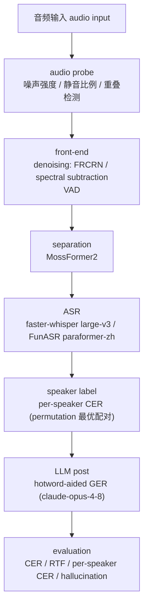
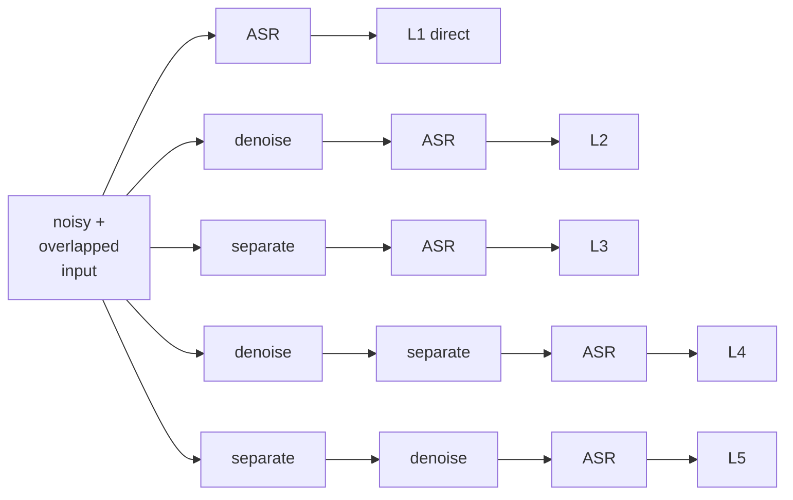
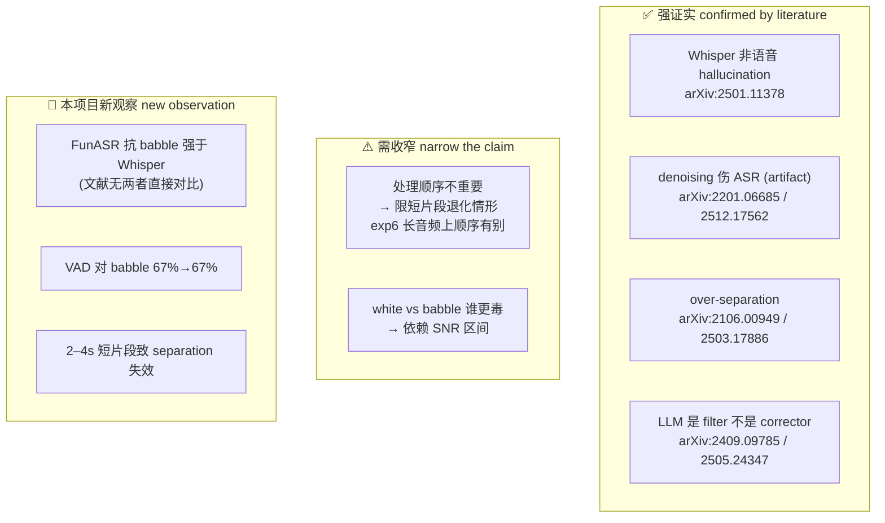
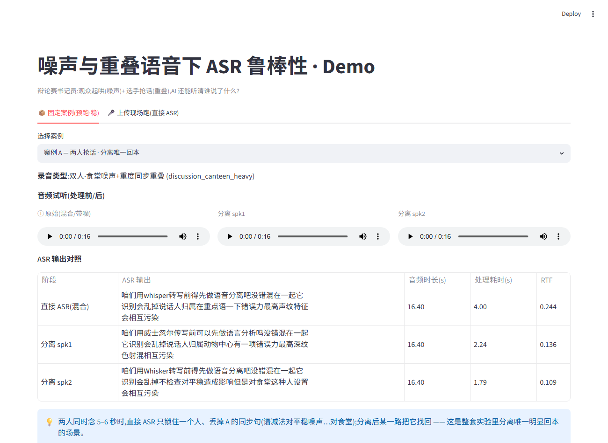

# 噪声与重叠语音场景下，本地音频预处理对 ASR 鲁棒性的影响研究

**When Does Audio Preprocessing Help ASR? A Study of Front-End Robustness in Noisy and Overlapped Speech**

> 本报告为中文主稿，技术术语保留英文。数据与结论以 `results/` 与 `LOG.md` 为准。
> 配套材料：实验日志 `LOG.md`、结论×文献对照 `results/literature_support.md`、消融总表 `results/ablation_summary.md`、demo `demo/`。

---

## 摘要 Abstract

现代 ASR 模型已具备相当强的抗噪能力，但"先降噪、先分离，再识别"这一类 front-end preprocessing 的工程直觉，是否在真实的 noisy + overlapped 约束下仍然成立，缺乏系统检验。本项目以辩论赛书记员场景（抢话 = overlapped speech，观众起哄 = background noise）为载体，在两个异构 ASR backend（faster-whisper large-v3、FunASR paraformer-zh）上，对 denoising、speech separation、VAD、LLM-based correction 四类前端/后端组件做受控 ablation study，并以 CER 与 real-time factor (RTF) 同时衡量 accuracy–efficiency trade-off。

核心发现：在 2–4 秒短片段、低 SNR、真实重叠的约束下，**大多数"高级"前端处理是负收益的，最简单的 direct ASR 在 15 个重叠条件中有 13 个取得最低 CER**；denoising 仅在 `FunASR × white noise × 低 SNR` 一个窄条件下稳定回本，speech separation 仅在 heavy 同步重叠下勉强回本，而 LLM 后处理的可靠价值是**识别并拒绝 hallucination**、而非恢复 acoustically lost 的字词。我们进一步观察到两个 backend 的 noise robustness profile 相反（Whisper 怕 babble、FunASR 怕 white，退化曲线在 0 dB 附近交叉），以及"为听清而降噪反而抹平了 paralinguistic 的情绪信息"这一副作用。所有结论均给出 failure case 与 literature 对照，并诚实标注哪些属于**证实已有结论**、哪些属于本项目的**新观察**、哪些需要**收窄表述**。

---

## 1. 引言与动机 Introduction

### 1.1 场景与叙事

我们把问题放进一个具体场景：辩论赛的"AI 书记员"。它要在两位辩手抢话（overlapped / cross-speech）、观众起哄（background noise）的条件下，听清"谁说了什么"。这个场景天然同时包含了课程给出的两个研究方向——Topic 3（本地音频预处理）与 Topic 1（speech separation + speaker labeling + LLM × ASR synergy）。

### 1.2 为什么这个问题值得研究

工程实践中有一条几乎默认的 pipeline 直觉：音频脏 → 先 denoise/separate → 再喂 ASR。但近年大规模弱监督 ASR（如 Whisper）本身已经在海量含噪数据上训练，具备较强的内生鲁棒性。这就产生了一个未被充分检验的问题：**当 ASR backend 已经很强时，额外的 front-end 处理究竟是在帮忙，还是在引入 distribution shift / processing artifact 反而帮倒忙？** 这正是一个适合用 ablation 与 failure analysis 去回答、而非一句"用了某模型效果不错"能带过的问题。

### 1.3 本文贡献

1. **在重叠语音工作上补充"噪声"维度**：学长工作（`xutong_paper.pdf`）聚焦 clean 条件下的 speech separation + speaker labeling + LLM 修正；我们补上 noise × overlap 共存这一更贴近真实的退化场景，并把"什么时候不该处理"作为一等公民去研究。
2. **系统比较 5 条处理链路（L1–L5）**：direct ASR / denoise→ASR / separate→ASR / denoise→separate→ASR / separate→denoise→ASR，用统一口径量化每一层的净效果与其窄适用边界。
3. **给出可操作的规则版选链路建议 + 多个 counter-intuitive findings**，并逐条对照公开 literature，区分"证实 / 收窄 / 新发现"。

---

## 2. 相关工作 Related Work

> 本节把项目涉及的五条技术线与公开文献对接，并指出每条与本项目的关系。结论级的逐条对照见 `results/literature_support.md`（已列 12 篇主要来源）。

### 2.1 鲁棒 ASR 与 Whisper hallucination
Whisper 通过 680k 小时弱监督训练获得对 ambient / white noise 的较强鲁棒性（Robust Speech Recognition via Large-Scale Weak Supervision, arXiv:2212.04356），其噪声鲁棒性甚至强到可兼作 audio event tagger（Whisper-AT, arXiv:2307.03183）。但同一套生成式解码在 non-speech / 低置信音频上会产生 hallucination：arXiv:2501.11378 系统性指出约 35% 的幻觉集中在少数固定短语；社区亦记录了 `Amara.org`、"like and subscribe" 等字幕训练数据污染（openai/whisper Discussion #928）。这直接对应我们 exp4 的观察。

### 2.2 Speech enhancement / denoising 对 ASR 的影响
"降噪一定有利于识别"并不成立。arXiv:2201.06685（How Bad Are Artifacts?）用 orthogonal projection 分解证明 **enhancement artifact 是 ASR 退化的主因**；arXiv:2512.17562（When De-noising Hurts，医疗 ASR）报告 40/40 配置在降噪后全部变差。这构成我们"高级前端不一定划算"主论点的硬核文献支撑。

### 2.3 Speech separation 与 over-separation
arXiv:2106.00949（Should We Always Separate?）的标题几乎就是我们的问题，主张按"是否真有重叠"动态决定是否分离，以避免在非重叠段过度分离产生 artifact；arXiv:2503.17886 进一步指出 separation front-end 会劣化 clean-backend ASR。对应我们 exp2 的 over-separation 现象。

### 2.4 LLM-based generative error correction (GER)
arXiv:2409.09785 给出 GER 的 challenge 与 baseline，指出 text-only 改写**无法恢复解码时已丢失/被剪枝的 acoustic 信息**，且完全改写会虚构未说内容；arXiv:2505.24347 用三阶段验证、logit-space anchoring 专门抑制 GER 幻觉。对应我们 exp3 的"LLM 是 filter 不是 corrector"。

### 2.5 Speech Emotion Recognition (SER)
我们用 emotion2vec 系列的自监督 SER 表征模型评估"预处理是否抹平情绪"。该线作为 paralinguistic 维度补强主论点（见 exp5）。
> 所用模型（emotion2vec、Paraformer/FunASR、MossFormer2、FRCRN、SepFormer、Conv-TasNet、DeepFilterNet）的原始论文引用编号已核实补全，见第 11 节 References。

### 2.6 前人工作及其局限（本文要补的洞）
学长工作（`xutong_paper.pdf`）建立了"speech separation → speaker labeling → LLM 语义修正"的 clean-condition pipeline，验证了该思路的可行性。我们识别出三点可深入的局限：
- **缺噪声维度**：未系统考察 background noise（尤其 babble 类人声噪声）如何同时破坏 ASR、separation 与 speaker attribution。
- **缺"是否该处理"的判据**：默认"分离→识别"，未检验在非重叠 / 短片段上分离是否反而有害（over-separation）。
- **缺 front-end trade-off 视角**：未把 RTF / 处理顺序 / artifact 风险纳入 accuracy–efficiency 权衡。

本项目正是围绕这三点展开。

---

## 3. 问题定义与研究假设 Problem Statement & Hypotheses

> 老师特别问到"你实际上在测试什么假设"。我们在立项时就把总问题拆成 5 个可证伪的 hypothesis，并在实验后逐条标注"证实 / 推翻 / 收窄"。

**总问题**：在 noise 与 multi-speaker overlap 条件下，哪些本地预处理真的能提升 ASR，哪些反而有害？

| # | 研究问题 | 假设（立项时） | 检验结果 |
|---|---|---|---|
| H1 | noise degradation | SNR 15→5→0 dB 时 CER 单调上升；babble（人声背景）比 white 伤害更大 | **部分证实，需收窄**：单调上升成立；white vs babble 的相对难度**依赖 SNR 区间**，仅在低 SNR / 交叉点附近 babble 对 Whisper 更毒（exp1） |
| H2 | denoising benefit | 降噪在低 SNR 有益，高 SNR 因 artifact 反而有害 | **证实**：仅 `FunASR × white × 低 SNR` 稳定回本；clean/高 SNR 降噪普遍有害（exp1） |
| H3 | processing order | noise + overlap 并存时，先降噪 vs 先分离对结果有显著影响 | **先否后立（边界定位，双引擎佐证）**：短片段上 L4/L5 无稳定差异（degenerate case）；exp6 拉长到 ~12 s 后顺序差异显现——**轻重叠先降噪(L4)，Whisper+FunASR 6/6 一致**（exp2 + exp6，详见 6.7 / 7.3） |
| H4 | LLM correction boundary | LLM 能修术语/格式，但修不了 acoustic 已丢失的错误 | **证实**：LLM 唯一可靠价值是拒绝 hallucination，通顺错词修不了（exp3） |
| H5 | engineering trade-off | 更复杂的链路不一定值得，存在低成本接近最优的方案 | **证实**：direct ASR 在 15 个重叠条件中 13 个最优（exp2 + ablation） |

---

## 4. 系统设计与选型论证 System Design & Design Rationale

> 这是本项目"做了真实权衡、而非默认套用"的核心证据。每个组件给出 `候选空间 → 评估标准 → 实测遇到的问题 → 最终选择 → 依据`。选型是在反复试验与失败中收敛的结果，不是一次性拍板。

### 4.1 整体 pipeline

**图 4.1 系统总架构**（mermaid，GitHub 直接渲染）：



**图 4.2 五条对比链路 L1–L5**（exp2 的核心 ablation）：



> 📌 **可选**：以上两图在 GitHub / 支持 mermaid 的查看器中直接渲染；若要导出 PDF 或放进视频/slides，建议用 mermaid-cli 或 draw.io 渲染成 PNG 后替换。

### 4.2 ASR backend 选型

- **候选空间**：openai-whisper、faster-whisper、WhisperX、wav2vec2、Conformer、FunASR (Paraformer)。
- **评估标准**：中文短片段 CER、6 GB laptop GPU 可跑、RTF 可接受、能**单独控制变量**（尤其 VAD 开关，供 exp4 用）。
- **为什么是 faster-whisper 而非 WhisperX**（直接回应老师）：WhisperX = faster-whisper + 强制 VAD + forced alignment + diarization，其增益主要面向**长音频**的时间对齐与说话人分离；而我们的对象是 2–4 秒短片段，**不需要 alignment / diarization**，且 exp4 要把 VAD 当作可开关的**自变量**单独研究——若用 WhisperX 把 VAD 焊死在 pipeline 里，反而失去控制权。faster-whisper 基于 CTranslate2，int8_float16 量化让 large-v3 能在 RTX 4050 Laptop 6 GB 上跑通（RTF ≈ 0.2–0.3），是更合适的底层引擎。
- **为什么再加 FunASR (paraformer-zh)**：我们需要一个**非 Whisper 的异构对照**，以检验"noise robustness 是模型特性还是普遍规律"。这一决定后来直接催生了项目最强的反直觉发现——两个 backend 的弱点相反（见 7.1）。若只用单一模型，会把"Whisper 的弱点"误当成"ASR 的弱点"。
- **最终选择**：faster-whisper large-v3 (int8_float16) + FunASR paraformer-zh 双引擎贯穿全程。

### 4.3 denoising 方法选型

- **候选空间**：DeepFilterNet（neural）、FRCRN（neural）、spectral subtraction / spectral gating（DSP, `noisereduce`）。
- **评估标准**：neural vs DSP 各取一个代表形成对照；零新增重依赖、可在现有环境复现。
- **实测遇到的问题（真实迭代）**：最初选 DeepFilterNet，但 Python 3.12 下无可用 `deepfilterlib` wheel，源码安装需引入 Rust 工具链，会显著扩大依赖复杂度并威胁可复现性。我们据此改用 ClearVoice 自带的 **FRCRN_SE_16K** 作为 neural 代表，spectral subtraction 作为 DSP 代表。
- **设计上的一个关键决定**：让 **clean 音频也过一遍降噪**。这不是为了模拟噪声，而是为了**证伪式地检验 H2**——如果高 SNR 下降噪仍提升 CER，则 artifact 假设不成立。结果 clean 降噪普遍有害（Whisper 4.9%→9.3%/14.7%），正向支撑了 artifact 主因论。
- **最终选择**：FRCRN（neural）+ spectral subtraction（DSP）双路对照。

### 4.4 speech separation 选型

- **候选空间**：Conv-TasNet、SepFormer、MossFormer2。
- **评估标准**：能处理中文重叠、预训练可直接推理、输出可用 ASR/相关性验证。
- **实测遇到的问题（真实迭代，重要 failure case）**：先用 SepFormer（sepformer-wsj02mix，英文 8k 训练）分离学长真实 `MidOverlap.wav`，两路输出内容高度雷同 → 判定分离失败，怀疑是 **domain mismatch**（英文训练 vs 中文测试）。改用 MossFormer2（ModelScope 中文）后，真实 `MidOverlap.wav` 仍不稳定，但在**自制完全重叠样本**上能分出与两源相关性 0.82 / 0.79 的两路。
- **由此产生的数据决策**：后续 overlap 定量实验**改用自制可控重叠样本**（con_i↔pro_i 等响度 0 dB SIR 错位混合，重叠 ratio 0 / 0.3 / 0.8），保证每个 speaker 都有 ground truth；学长真实重叠样本降级为**定性 failure case**。这是"为保证 ground truth 可控而主动改数据方案"的研究决定，而非figured随手选择。
- **最终选择**：MossFormer2，配自制可控重叠数据。

### 4.5 VAD、SER、LLM 的选型

- **VAD**：用 faster-whisper 可开关的 Silero VAD，目的是把 VAD 作为 exp4 的自变量（on/off 对照），而不是默认开启。
- **SER**：`iic/emotion2vec_plus_large`，与已用的 paraformer-zh / MossFormer2 / FRCRN 同属 FunASR/ModelScope 栈，**零新增依赖**即可复用已落盘的处理前后音频做情绪漂移对比。
- **LLM correction**：claude-opus-4-8（中转 API），盲测（纠错时不给 reference），对照"无纠错 / 纯 LLM / hotword-aided"三档。

### 4.6 评测口径设计

- **CER** 而非 WER：测试语料为中文，采用字符级编辑距离（jiwer，去标点/空白）。
- **RTF**：处理耗时 / 音频时长，分环节记录（denoise RTF / separate RTF / ASR RTF），链路 RTF 为各环节相加。
- **per-speaker CER**（permutation 最优配对）替代人工 speaker-attribution error rate：因 separation 普遍失败、两路常复制混合，人工标注 attribution 已无意义。
- **跨实验数据域声明**：exp1（域 A，单说话人降噪）、exp2（域 B，重叠分离）、exp3（域 C，LLM 纠错）**绝对 CER 不可跨行直接比**，跨行只比"净效果方向"。详见 `results/ablation_summary.md` 口径声明。

---

## 5. 实验设置 Experimental Setup

| 项 | 设置 |
|---|---|
| clean 语料 | 26 条中文辩论短片段，2–4 s，16 kHz mono，人工校对转写存 `refs/`（草稿来自 Whisper，逐条听音校正，避免偏向 Whisper） |
| overlap 语料 | 自制：con_i↔pro_i 等响度 0 dB SIR 错位混合，ratio {0, 0.3, 0.8}；另有学长 5 条真实重叠作定性对照 |
| noise | white（synthetic）+ babble（英文语音错位叠加，与中文目标无文本泄漏）；SNR {15, 5, 0} dB，实测 SNR 误差 0.000 dB |
| real 录音 | 6 条真实手机录音（dorm / canteen / classroom / discussion ×3） |
| backend | faster-whisper large-v3（int8_float16）、FunASR paraformer-zh |
| front-end | FRCRN_SE_16K、spectral subtraction、Silero VAD、MossFormer2 |
| SER | emotion2vec_plus_large |
| 硬件 | RTX 4050 Laptop 6 GB |
| 指标 | CER、RTF、per-speaker CER、hallucination case |

> 数据生成与运行脚本见 `src/`（`make_noises.py` / `add_noise.py` / `make_overlap.py` / `run_asr.py` / `denoise.py` / `separate.py` / `evaluate.py` 等），最小复现实步骤见 `README.md`。

---

## 6. 实验与结果 Experiments & Results

> 每个实验统一模板：假设 → 设置 → 结果 → failure case → 发现。数字以 `results/` 为准。

### 6.1 实验 1：noise × denoising × ASR（域 A）

- **假设**：H1 + H2。
- **设置**：26 条 clean × {white, babble} × SNR{15,5,0}（+ clean 也过降噪）× {none, FRCRN, specsub} × {Whisper, FunASR}。
- **结果**（CER%，`none → FRCRN → specsub`；完整数据 `results/asr_raw.csv` / `results/summary.csv`）：

| 条件 | Whisper | FunASR |
|---|---|---|
| clean | 4.9 → 9.3 → 14.7 | 10.1 → 8.5 → 13.0 |
| white 15 dB | 7.4 → 16.6 → 14.4 | 9.6 → 12.0 → 14.6 |
| white 5 dB | 12.2 → 33.2 → 32.3 | 29.4 → 17.0 → 16.8 |
| white 0 dB | 41.9 → 49.9 → 61.7 | **68.4 → 27.5** → 40.1 |
| babble 15 dB | 5.4 → 17.0 → 19.0 | 8.5 → 12.7 → 16.1 |
| babble 5 dB | 20.6 → 78.6 → 47.1 | 22.3 → 52.3 → 30.1 |
| babble 0 dB | 71.7 → 92.5 → 83.7 | 43.3 → **95.1** → 46.2 |

降噪耗时：specsub RTF ≈ 0.018，FRCRN RTF ≈ 0.105（约 6×）。
退化曲线 `results/exp1_denoise_curves.png`，热力图 `results/exp1_denoise_heatmap.png`，典型案例 `results/exp1_cases.txt`。

- **failure case**：`babble_0dB / FunASR / FRCRN / con_001.wav`——原本还能识别部分中文，FRCRN 后输出英文句子（neural denoiser 把目标中文当背景人声删掉，残留英文背景主导 ASR）。
- **发现**：① 降噪非稳定增益，仅 `FunASR × white × 低 SNR` 大幅回本（68.4→27.5）；② babble + neural denoise = 灾难（43.3→95.1）；③ clean 降噪普遍有害，证伪"高 SNR 也该降噪"；④ "neural 一定优于 DSP"不成立。

### 6.2 实验 2：noise + overlap × 处理顺序（域 B）

- **假设**：H3 + H5。
- **设置**：自制重叠 × ratio{0,0.3,0.8} × {babble,white}×{5,0}dB(+clean) × 五链路 L1–L5。
- **结果**（content CER，15 cell 均值；明细 `results/exp2_summary.csv` / pivot 表 `results/exp2_pivot.md`）：

| 链路 | content CER | spk CER | 15 格最优数 |
|---|---|---|---|
| L1 direct | **39.8** | — | **13** |
| L2 denoise→ASR | 52.5 | — | 0 |
| L3 separate→ASR | 68.2 | 88.1 | 2（均 heavy） |
| L4 denoise→separate | 67.4 | 84.9 | 0 |
| L5 separate→denoise | 65.3 | 85.2 | 0 |

链路 RTF：specsub 0.018 / separate 0.13 / whisper 0.2 → 分离链路耗时约为 L1 的 2–3×。

- **failure case**：轻度重叠下 separation 复制失败（spk1≈spk2≈整句混合）；0 dB babble 下分离两路皆触发 Whisper hallucination。
- **发现**：① **over-separation**——L1 在 13/15 格最优，分离仅 heavy 重叠回本（clean/heavy 50.0→46.9）；② spk CER 恒在 84–88%，说明 MossFormer2 对 2–4 s 短片段**根本没分开**；③ L4/L5 无稳定差异（H3 在此条件下推翻，但属 degenerate case，见 7.3）。

**图 6.2 五链路按 overlap 程度的 content CER 对比**（在 5 个噪声条件上取均值，Whisper；绘图脚本 `src/plot_exp2.py`）：


该图直观呈现 **over-separation**：no-overlap 时 L1 (23.8%) 远低于分离链路 L3/L4/L5（≈64–70%）；随重叠加重 L1 优势收窄，到 heavy 时 L1 (63.3%) 与 L3 (64.0%) 已基本持平（分离仅在个别 heavy cell 反超）。即分离只在重叠最严重时才把差距追平，多数条件下纯属增加 artifact 与耗时。

### 6.3 实验 3：LLM-based generative correction（域 C）

- **假设**：H4。
- **设置**：取 exp1/2 中 5 条代表性错误（术语错×2 / 近音错 / 综艺幻觉 / 字幕幻觉），盲测对照"无纠错 / 纯 LLM / hotword-aided"，模型 claude-opus-4-8。
- **结果**（content CER；明细 `results/exp3_correction.md` / `.csv`）：

| 案例类型 | raw | 纯 LLM | hotword |
|---|---|---|---|
| 术语错·通顺（好意） | 0.158 | 0.158 | 0.158 |
| 术语错·声学差远（玩具） | 0.40 | 0.40 | **1.0** |
| 近音错（说/多） | 0.077 | 0.077 | 0.077 |
| 综艺幻觉 | 2.286 | **0.571** | 0.571 |
| 字幕幻觉 | 1.579 | **0.842** | 0.842 |

- **发现**：LLM 唯一可靠价值 = **识别并拒绝 hallucination**（输出 `[无法识别]`，不脑补）；acoustic 已丢失的通顺错词修不了；hotword 无增益甚至帮倒忙（声学差太远时无法桥接，"玩具"案例 0.40→1.0）。**LLM 是 filter，不是 corrector。**

### 6.4 实验 4：Whisper hallucination + VAD 边界

- **假设**：non-speech / 低置信音频诱发固定模式 hallucination；VAD 能抑制但有边界。
- **设置**：给 Whisper 喂纯噪声/静音段（`data/exp4/`），并做 VAD on/off 对照。
- **结果**（明细 `results/exp4_hallucination.csv` / `.md`，对比图 `results/exp4_vad_compare.png`）：VAD off 时 hallucination rate ≈ 91%；white/silence 100%→0%（VAD 压得住）；**babble 67%→67%（VAD 压不住人声型噪声）**。
- **发现**：幻觉是**固定模式、非随机**（字幕平台残留 Amara.org / "请不吝点赞订阅" / 字幕组署名），与 arXiv:2501.11378 高度一致；VAD 把"像人话"的连续 babble 判为语音放行，正是 babble 0 dB 最毒的根因——这条 67%→67% 是本项目的直接实证。

### 6.5 实验 5：emotion × preprocessing（paralinguistic 维度）

- **假设**：denoising/separation 会系统性削平高唤醒情绪（angry），即"为听清而处理 → 抹掉了话是怎么说的"。
- **设置**：对同一条音频在降噪/分离前后各跑一次 emotion2vec，比较 P(angry)（脚本 `src/run_emotion.py`，明细 `results/exp5_emotion*.csv/.md`，漂移图 `results/exp5_emotion_drift.png`）。
- **结果**：17 条 angry 片段 P(angry) 均值 clean 0.89 → FRCRN 0.85（翻转 1/17）→ spectral subtraction 0.65（翻转 4/17）；separation source 0.63 → L3 (no/light/heavy) 0.37/0.47/0.35。
- **发现**：预处理系统性**削平情绪**，且 **separation > denoising、spectral subtraction > neural** 地擦除 paralinguistic 信息。典型案例：`pro_014` angry→specsub 后 neutral、`con_005` angry→specsub 后 happy。这为主论点补上"前端处理不仅伤 ASR、还擦掉情绪"的一层。

### 6.6 真实录音泛化抽查 generalization spot-check

- **设置**：6 条真实手机录音，baseline 与最佳链路各跑一遍，人工 spot-check（无逐字 ground truth，不强算 CER）。明细 `results/real_asr.csv` / `results/real_spotcheck.md`，中间产物 `data/real/{raw,denoised,sep_L3,sep_L4}/`。
- **发现**：真实录音**独立复现**了 exp1/2 的全部主结论——direct ASR 最稳；canteen + 谱减触发"请不吝点赞订阅"字幕幻觉、L4 触发"中文字幕志愿者"；仅 heavy 同步重叠分离才回本（spk2 找回被 direct ASR 丢掉的同步句）；VAD 双刃；英文专名稳定转错（支撑 exp3 hotword 动机）。**泛化成立。**

**Audio examples（固定案例集，可现场试听 / 入视频）**：下列 5 个案例取自真实录音，处理前后音频在 `demo/audio/`，逐句 ASR 文本对照与讲点见 `demo/cases.md`。它们把"什么时候该处理、什么时候帮倒忙"做成了**听得见**的证据：

| 案例 | 场景 | 现象（一句话） | 音频 |
|---|---|---|---|
| A | 双人·食堂噪声+重度同步重叠 | **分离唯一回本**：直接 ASR 丢掉 A 的同步句，分离后某一路找回 | `caseA_heavy_raw.wav` / `caseA_heavy_sep_spk{1,2}.wav` |
| B | 双人·食堂噪声+自然插话 | **direct ASR 够用**：几乎全文转出 → 伤 ASR 的是"同步重叠时长"而非"有没有噪声" | `caseB_canteen_raw.wav` |
| C | 双人·安静重叠 | **分离帮倒忙**：spk2≈整句混合复制、spk1 只剩碎片 | `caseC_quiet_raw.wav` / `caseC_quiet_sep_spk{1,2}.wav` |
| D | 单人·食堂强噪 | **降噪反害**：谱减伪影末尾凭空冒出"请不吝点赞订阅" | `caseD_canteen_raw.wav` / `caseD_canteen_specsub.wav` |
| E | 单人·教室轻噪 vs 食堂强噪 | **VAD 双刃**：轻噪下消掉尾部幻觉（有益）/ 强噪下切掉真实语音中段（有害） | `caseE_classroom_raw.wav` |

### 6.7 实验 6：长音频 length ablation（域 B 边界，验证 H3 根因）

- **假设**：检验 H3 的根因——exp2「处理顺序无稳定差异」究竟是普遍规律，还是 2–4 s 短片段 separation 全盘失效（spk CER 84–88%）的 degenerate artifact？拉长到 ~12 s 后，(a) separation 是否回本；(b) L4/L5 是否出现差异。
- **数据出处确认**：经学长 `xutong_paper.pdf` 表 4.12 核实，con/pro 源自一段 62.4 s **双人**辩论质询片段、人工切分出单人片段——con_* 全为反方一人、pro_* 全为正方一人，故拼接同一角色多条 = 连贯真实单说话人，非"假说话人"，双说话人 ground truth 仍严格成立。
- **设置**：`src/make_exp6.py` 复用 `make_overlap.mix_pair`，每角色固定种子拼 ~12 s，按 {light=0.3, heavy=0.8} 等响度错位混合；clean + babble_0dB + white_0dB；跑 L1/L3/L4/L5（砍 L2，不涉顺序），**Whisper + FunASR 双引擎**（异构对照，验证顺序效应非单模型特性）+ specsub + MossFormer2。5 样本 × 2 档 × 3 噪声 × 4 链路 × 2 引擎 = 420 条转写。脚本 `src/{make_exp6,run_exp6,eval_exp6,plot_exp6}.py`，明细 `results/exp6_{summary.csv,pivot.md}`、`data/exp6/manifest.csv`。
- **结果**（Whisper content CER%，`short=exp2 短片段 → long=本实验`）：

| cond | level | L1 | L3 | L4 | L5 |
|---|---|---|---|---|---|
| clean | light | 11.3 → 17.9 | 57.6 → 82.9 | 61.3 → 73.7 | 48.8 → 86.9 |
| clean | heavy | 50.0 → 52.1 | 46.9 → 49.1 | 58.9 → 51.3 | 57.4 → **47.7** |
| babble_0dB | light | 58.3 → 53.6 | 100.6 → 93.7 | 76.5 → **64.0** | 80.5 → 90.6 |
| babble_0dB | heavy | 90.7 → 86.6 | 70.3 → 89.1 | 86.3 → 92.9 | 77.3 → 89.2 |
| white_0dB | light | 32.5 → 29.9 | 64.2 → 48.1 | 68.7 → **47.2** | 64.4 → 51.8 |
| white_0dB | heavy | 60.1 → 59.5 | 63.0 → 65.7 | 71.8 → 75.4 | 66.4 → 63.0 |

**处理顺序 L4 vs L5 双引擎对照（content CER%，胜者=更小）**——light 重叠 6/6 一致偏向 L4（先降噪）：

| cond/level | whisper L4 / L5 | funasr L4 / L5 |
|---|---|---|
| clean/light | **73.7** / 86.9 | **87.6** / 91.5 |
| babble_0dB/light | **64.0** / 90.6 | **51.4** / 99.8 |
| white_0dB/light | **47.2** / 51.8 | **44.3** / 60.0 |
| clean/heavy | 51.3 / **47.7** | 56.1 / **54.6** |
| babble_0dB/heavy | 92.9 / **89.2** | **73.9** / 82.3 |
| white_0dB/heavy | 75.4 / **63.0** | 67.6 / **55.5** |

per-speaker CER（long, Whisper）：仅 clean/heavy 降到 ~50%，其余多在 75–94%。short vs long 对比图 `results/exp6_length.png`。

- **failure case（顺序效应机理）**：`babble_0dB / light / s2`——**L5（先分离）**把带噪混合直接喂分离器，spk1=spk2="中文字幕志愿者 李宗盛"（两路全坍成字幕 hallucination，彻底失败）；**L4（先降噪）**给分离器干净输入，救回一路真实内容。即降噪前置避免 separator 被噪声诱导出双路幻觉，这是 L4 在轻重叠+噪声下大幅领先的机理。
- **发现**：① separation 在长音频上**仍大面积失败**（spk 多 75–94%）→「短片段难分」非唯一主因，根本是模型对中文重叠语音的能力问题；② **处理顺序确有差异且跨引擎稳健**——light 重叠 **6/6（双引擎×3 噪声）一致偏向先降噪(L4)**，babble 下最猛（whisper −27 / funasr **−48**），heavy 重叠则 L5 多数微弱占优；FunASR 独立证实顺序效应**非 Whisper 特性**；③ **separation 是否回本取决于引擎的噪声弱点**：Whisper 仅 clean/heavy 勉强回本，FunASR clean/heavy **不**回本却在 **white_0dB 大幅回本**（L1 76.9/88.7 → 分离 44.3/55.5），因 FunASR 本身怕 white（exp1）→ **呼应 exp1「两引擎弱点相反」**。
- **对 H3 的升级**：从"degenerate-case 退化观察"升级为 **boundary-condition 定位**并经异构引擎佐证——*分离全败的短片段上无差异；给足时长后顺序确有差异，**轻重叠应先降噪(L4)，双引擎 6/6 一致***，**部分复活 exp2 立项时被否的假设**（先降噪让分离器更易工作）。caveat：N=5/格属定性，heavy 部分链路接近地板该处差异不可靠；最硬证据是 light 重叠的 L4>L5（双引擎）与 FunASR×white 回本。

---

## 7. 讨论 Discussion

### 7.1 Counter-intuitive findings（项目核心 insight）

1. **两 backend 弱点相反**：Whisper 抗 white、怕 babble（诱发 hallucination）；FunASR 相反。两条退化曲线在 0 dB 附近交叉。→ 若只用单模型，会把模型弱点误判为 ASR 普遍弱点。
2. **"高级预处理"在短片段普遍负收益**：separation/denoising 在 2–4 s 辩论片段上几乎全程帮倒忙，只有 heavy 重叠勉强回本。
3. **处理顺序的差异随片段长度浮现（且跨引擎稳健）**：短片段上 L4/L5 差异小（separation 已失效的退化情形），但 exp6 拉长到 ~12 s 后差异显现——**轻重叠应先降噪(L4)，Whisper+FunASR 6/6 一致**，babble 下最猛（−27 / −48 pt）；另发现 separation 回本与否随引擎噪声弱点而变（FunASR×white 回本，呼应 #1）（见 6.7 / 7.3）。
4. **降噪改变 Whisper 错误模式**：hallucination → silence（降噪后大量空转写）。
5. **VAD 有边界**：压得住 white/silence（100%→0%），压不住 babble（67%→67%）。
6. **LLM 是 filter 不是 corrector**：能拒幻觉，修不了 acoustic 已丢失的通顺错词。
7. **预处理抹平情绪**：denoising/separation 系统性削平 angry（exp5）。

### 7.2 Accuracy–efficiency trade-off 与规则版选链路

trade-off 简表/散点见 `results/tradeoff_summary.md` 与 `results/tradeoff.png`。综合 CER 与链路 RTF，给出规则版建议：

```text
babble 且 SNR 低     → direct ASR（降噪会消人声；Whisper 易幻觉，可加 VAD 兜底）
white  且 SNR 低     → FunASR + neural denoise（唯一稳定正收益组合）
overlap no / light   → direct ASR（分离纯属画蛇添足）
overlap heavy（抢话）→ 才考虑 separation，且预期收益有限
输出疑似幻觉/无关     → LLM 过滤为 [无法识别]，不指望它修字词
```

### 7.3 与文献对照：证实 / 收窄 / 新发现

完整逐条见 `results/literature_support.md`。择要：
- **强证实**：Whisper 非语音幻觉（2501.11378）、降噪伤 ASR（2201.06685 / 2512.17562）、over-separation（2106.00949 / 2503.17886）、LLM 是 filter（2409.09785 / 2505.24347）。
- **需收窄**：① "处理顺序不重要"——文献无此普适结论，且本项目短片段 spk CER 84–88% 说明 separation **根本没分开**，L4/L5 看不出差异属 degenerate case，**不可外推为"顺序无所谓"**；exp6 拉长到 ~12 s 后已定位边界——**轻重叠先降噪(L4)，Whisper+FunASR 6/6 一致**，顺序确有差异（见 6.7）；② "white vs babble 谁更毒"依赖 SNR，**不可写成单调关系**。
- **新发现（本项目实证）**：FunASR 抗 babble 强于 Whisper（文献无 Whisper vs Paraformer 直接对比）；VAD 对 babble 67%→67% 的具体数字；短片段（2–4 s）导致 separation 失效的现象。

**图 7.3 结论 × 文献三态对照**（证实 / 收窄 / 新发现）：



---

## 8. 局限与未来工作 Limitations & Future Work

**局限（诚实陈述）**：
- 语料以 2–4 s 中文短片段为主、小样本（26 clean + 自制重叠 + exp6 长音频 5 样本），结论不应外推到更长音频 / 多语种。
- MossFormer2 在该数据上普遍失效，exp2 的分离相关结论是在"分离基本不可用"前提下得出的退化观察；exp6 证实即便拉长到 ~12 s，separation 在多数条件仍失败（仅 clean/heavy 回本），但处理顺序差异随之显现。
- real 录音抽查无逐字 ground truth，为定性 spot-check。

**Future work**：
- ~~exp6 长音频 length ablation~~ → **已完成（见 6.7）**，定位了边界（长 heavy 分离回本、长+轻重叠下降噪应前置）；仍可做更长音频 + context padding 缓解短片段分离。
- E5a：用带标签情感语料（ESD / CASIA / RAVDESS）画"emotion × CER"退化曲线，与 noise 退化曲线对仗。
- emotion + LLM 收口：把 `[emotion]` 标签与 ASR 文本一起喂 LLM 输出结构化记录。
- **Scope-out（明确不做）**：beamforming、echo cancellation、移动端部署、大规模模型训练，留作工程外延说明。

---

## 9. 结论 Conclusion

在 noise 与 overlap 约束下、2–4 s 短辩论片段上，**最简单的 direct ASR 几乎总是性价比最高**：在 15 个重叠条件中 13 个取得最低 CER，复杂 front-end 仅在极窄条件（`FunASR × white × 低 SNR` 的降噪、heavy 重叠的分离）才回本。这正面回答了项目总问题——**大多数"高级预处理"在真实约束下不划算**，而其代价不仅是 CER 与 RTF，还包括抹平 paralinguistic 的情绪信息。两个 backend 的相反 robustness profile、VAD 对 babble 的失效、LLM 作为 hallucination filter 而非 corrector，构成了一组可被 literature 印证、也包含本项目新观察的结论。负结果在此被当作一等结果对待：知道"什么时候不该处理"，与知道"什么处理有用"同样有价值。

---

## 10. 复现 Reproducibility 与 Demo

环境与最小流程见 `README.md`；逐实验过程、数值、踩坑与决策见 `LOG.md`。

**交互式 demo**（Streamlit）：`demo/app.py`，两个 Tab——Tab1 展示 5 个固定案例（处理前后音频 + 文本对照），Tab2 支持上传音频现场跑 direct ASR 并显示耗时。运行：

```bash
.venv/Scripts/streamlit run demo/app.py
```

**图 10.1 Demo 界面截图**：



> 📌 **待补（截图）**：请按上面命令启动 demo，截一张界面图（建议含 Tab1 案例 + 处理前后试听按钮）存为 `results/demo_screenshot.png`，即可在此处自动显示。老师明确点名要 screenshots。

---

## 11. 参考文献 References

> 已核对（取自 `results/literature_support.md`）：

1. Robust Speech Recognition via Large-Scale Weak Supervision (Whisper) — arXiv:2212.04356
2. Whisper-AT: Noise-Robust ASR are Strong Audio Event Taggers — arXiv:2307.03183
3. Investigation of Whisper ASR Hallucinations Induced by Non-Speech Audio — arXiv:2501.11378
4. Calm-Whisper: Reduce Whisper Hallucination on Non-Speech — arXiv:2505.12969
5. openai/whisper Discussion #928 (dataset bias "Amara.org")
6. WhisperX (VAD preprocessing reduces hallucination) — github.com/m-bain/whisperX
7. How Bad Are Artifacts? Analyzing the Impact of Speech Enhancement Errors on ASR — arXiv:2201.06685
8. When De-noising Hurts: Speech Enhancement Effects on Medical ASR — arXiv:2512.17562
9. Should We Always Separate? Switching Between Enhanced and Observed Signals — arXiv:2106.00949
10. Decoupling Speaker Separation and Speech Recognition — arXiv:2503.17886
11. LLM-Based Generative Error Correction: A Challenge and Baselines — arXiv:2409.09785
12. Fewer Hallucinations, More Verification: Three-Stage LLM ASR Correction — arXiv:2505.24347
13. Audio-Visual Efficient Conformer (white vs babble WER) — arXiv:2301.01456

> 所用模型 / 工具的原始论文（已核实 arXiv 编号）：

14. Paraformer: Fast and Accurate Parallel Transformer for Non-autoregressive End-to-End Speech Recognition — arXiv:2206.08317
15. FunASR: A Fundamental End-to-End Speech Recognition Toolkit — arXiv:2305.11013
16. MossFormer2: Combining Transformer and RNN-Free Recurrent Network for Enhanced Time-Domain Monaural Speech Separation — arXiv:2312.11825
17. FRCRN: Boosting Feature Representation using Frequency Recurrence for Monaural Speech Enhancement — arXiv:2206.07293
18. ClearerVoice-Studio: Bridging Advanced Speech Processing（FRCRN / MossFormer2 所属工具箱）— arXiv:2506.19398
19. emotion2vec: Self-Supervised Pre-Training for Speech Emotion Representation — arXiv:2312.15185
20. Attention is All You Need in Speech Separation (SepFormer) — arXiv:2010.13154
21. Conv-TasNet: Surpassing Ideal Time-Frequency Magnitude Masking for Speech Separation — arXiv:1809.07454
22. DeepFilterNet: A Low Complexity Speech Enhancement Framework for Full-Band Audio based on Deep Filtering — arXiv:2110.05588
